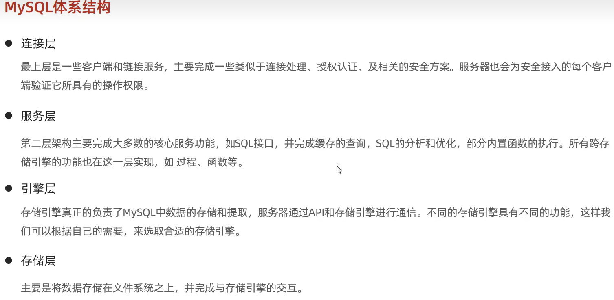
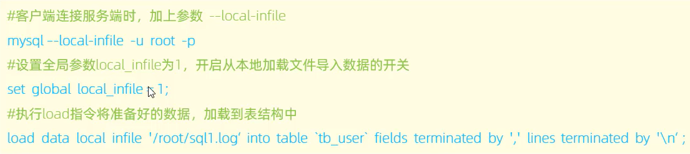
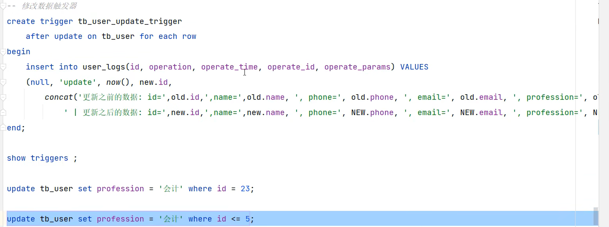
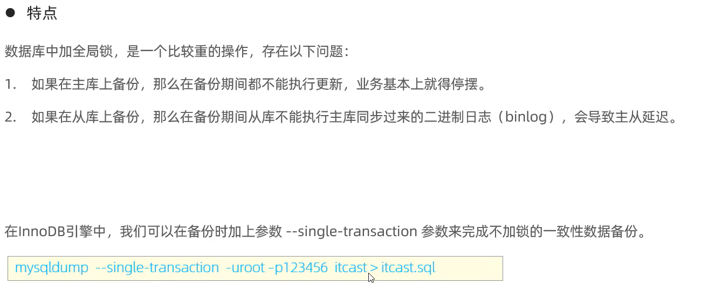
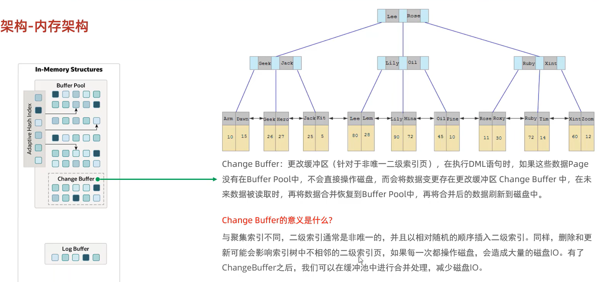

# MySQL体系结构





desc 表名：查看表详情

# sql语法及分类

## DDL：

数据定义语言，create，drop，alter

修改表名：

alter table 表名 **rename to**  新表名；

修改数据类型：

Alter table 表名 **modify** 字段名 新数据类型（长度）；

修改字段名和字段类型：

alter table 表名 **change** 旧字段 新字段类型（长度） [ comment 注释] [约束]

## DML：

数据操纵语言，insert，update，delete

INSERT INTO 表名 (列1, 列2, 列3) VALUES (值1, 值2, 值3);

UPDATE 表名 SET 列1 = 新值1, 列2 = 新值2 WHERE 条件;

DELETE FROM 表名 WHERE 条件;

## DQL：

数据查询语言，select

## DCL:

数据控制语言：create user，alter user  ，drop user，grant，revoke

> mysql_native_password：不是原来的密码，就是一个固定的关键词


权限控制：

+ 查询权限：show grants for '用户名'@'主机名';
+ 授予权限：grant 权限列表 on  库名.表名 to '用户名'：'主机名';
+ 撤销权限：revoke 权限列表 on 库名.表名 from  '用户名':'主机名'；


# 关键字

## using

using关键字的概念：

- 连接查询时如果是同名字段作为连接条件，using可以代替on出现（比on更好）
- using 是针对同名字段（using(id)===on A.id=B.id）
- using 关键字使用后会自动合并对应字段为一个
- using 可以同时使用多个字段作为条件


# 事务

## 事务四大特性ACID：

+ 原子性：事务是不可分割的最小操作单元，要么全部成功，要么全部失败
+ 一致性：事务完成时，必须使所有的数据都保持一致状态
+ 隔离性：数据库系统提供的隔离机制，事务可不受外部并发操作影响
+ 持久性：事务一旦提交或回滚，他对数据库中的数据改变就是永久的


## 并发事务问题

+ 脏读：一个事务读到另一个事务修改了但还没有提交事务的数据（把人家没提交事务的数据读到了自己的事务中，其实应该加锁）
+ 不可重复读：一个事务先后读取同一条记录，两次读取的数据不同（被其他人修改了），称之为不可重复读
+ 幻读：一个事务按照条件查询数据时，没有对应的数据行，但是在插入数据时【被人插入过了已经】，又发现这行数据已经存在【但是自己查看不到】，好像出现了“幻读’

> 解决不可重复读：使用了版本号？
>
> 幻读：是在解决不可重复读的基础加了版本号？导致另一个人看不到插入的数据，但是实际已经被插入了？

完美解决：使用锁，但是会影响性能

## 事务隔离级别

read commited：只是读取提交过事务的数据，如果事务中还未提交，读取的是提交之前的数据


> 性能级别由高到低，Serializable：串行化

## 事务原理

原子性、一致性、持久性的实现依赖：redo log，undo log

隔离性的实现依赖：锁机制、MVCC（多版本并发控制）


### redo log

重做日志： 持久化的基础

wal：先写日志（预写日志）


### undo log 

回滚日志，用来解决原子性

用于记录修改前的信息，作用：提供回滚和MVCC（多版本并发控制）


> 即使是销毁，也不是完全删除，因为后续还需要用回滚日志做版本控制


# 存储引擎

> 索引是在存储引擎中实现的，所以不同存储引擎的索引结构也有所不同


存储引擎的选择和场景有关，不能一棒子打死

存储引擎控制的就是mysql中的**数据存储和提取**的方式

## 存储引擎简介

存储引擎就是  存储数据，建立索引，更新/查询数据等技术的**实现方式**【底层实现】，**存储引擎是基于表的**，而不是基于库的，存储引擎也可被称为表类型【每个表可以选择不同的存储引擎，同一数据库下的多个表也可以】


## 存储引擎应用

InnoDB：存储业务系统中对于事务，数据完整性要求较高的核心数据

MyISAM：存储业务系统的非核心事务


## InnoDB

InnoDB是一种兼顾高可靠性和高性能的通用存储引擎，v5.5后是默认的，5.5之前是myIsam。

特点：

+ 支持事务
+ 行级锁，提高并发访问性能
+ 支持外键 foreign key  约束，保证数据的完整性和正确性

文件：

**xxx.ibd**:  xxx是表名，InnoDB引擎的每张表都会对应这样一个表空间文件，**存储该表的表结构**（frm（8.0之前）、sdi（8.0之后）），**数据和索引**

### 逻辑结构


## MyISAM

介绍：

早期5.5之前的默认存储引擎

特点：

+ 不支持事务，不支持外键
+ 支持表锁，不支持行锁
+ **访问速度快**

文件：

xxx.sdi:存储表结构信息

xxx.MYD:存储数据

xxx.MYI:存储索引


## Memory

介绍：

Memory引擎的表数据是存储在内存中的，由于受到硬件问题，或断点问题的影响，只能将这些表作为临时表或缓存使用

特点：

+ 内存外放

+ hash索引（默认）

文件：

xxx.sdi:存储表结构信息


## 三个存储引擎的特点和区别


# 索引

> 如果不设置索引，mysql使用InnoDB引擎时使用默认创建的聚簇索引进行顺序排列

## 介绍

索引是一种**有序的数据结构**，用来帮助MySQL**高效获取数据的**

> 索引就是帮忙查数据的

二叉树，红黑树，B+Tree，B-Tree 

| 优势                                              |                            劣数据                            |
| :------------------------------------------------ | :----------------------------------------------------------: |
| 数据检索效率提高，降低数据库的IO成本              |                    索引占用空间【可忽略】                    |
| 通过对索引排序，降低数据排序的成本，降低CPU的消耗 | 索引降低更新表的速度，insert，update，delete等操作会**导致维护索引，效率降低** |

> 平时业务系统还是查询操作占多数

## 索引语法


## 索引结构


> Full-text（全文索引）：建立**倒排索引**，es也是
>
> R-tree（R树）


## Hash结构

特点：

+ hash索引只能用于对等比较（=，in），不支持范围查询（between，>,<...）
+ 无法利用索引完成排序操作
+ 查询效率高，**通常**（不出现hash冲突）只需要一次检索就可以了，效率通常要高于B+tree索引

## 索引分类

> 人话：
>
> 主键索引对应聚集索引，其他索引都是二级索引

对于联合索引来说，**使用索引的字段顺序是有区别的**


InnoDB存储引擎，根据索引的存储形式


> 回表查询：二级索找出来主键还需要再通过聚集索引进行查询【聚集索引找到的才是行数据】,
>
> **回表查询的前提是出现了二级索引和主键id之外的查询字段**，如果未出现，还是走的一个二级索引即可


> 二级索引/辅助索引叶子节点存储的是对应数据的主键


## SQL性能分析

### sql执行频率

show [session|global] status  like  'Com_______________'(7个_);查看当前会话|全局  的insert，update，delete，select的访问频次。

### 慢查询日志

> tail -f  /var/lib/mysql /localhost-slow.log
>
> 重启服务systemctl restart mysqld


### profile


> profile：获取时间耗费到哪里，哪一句


### explain执行计划

>在 MySQL 中，EXPLAIN 是一个用于查询执行计划分析的关键字。通过执行 EXPLAIN 查询，可以获得查询语句的执行计划，并了解查询过程中所使用的索引、连接类型等信息。在 EXPLAIN 的查询结果中，有一个名为 `type` 的列，它表示表访问的方式/类型。以下是常见的 `type` 类型：
>
>1. `const`：使用常量进行的查询，只返回一行结果，通常在使用主键或唯一索引的等值查询时出现。
>2. `eq_ref`：对于每个读取的行，使用索引进行唯一查找，常见于使用主键或唯一索引的连接查询。
>3. `ref`：使用非唯一索引进行查找，返回多个匹配行。
>4. `fulltext`：通过全文索引进行搜索。
>5. `ref_or_null`：类似于 `ref`，但包括空值（NULL）的匹配行。
>6. `index_merge`：使用多个索引进行搜索，然后将结果合并。
>7. `range`：使用索引范围进行查找，例如使用 >、< 等比较操作符的查询。
>8. `index`：完全扫描索引进行查询，但不访问实际数据行。
>9. `all`：全表扫描，检查每一行以满足查询条件。
>10. `system`：仅有一行结果的查询，通常为系统表查询。
>11. `unique_subquery`：使用了子查询的唯一索引查找。
>12. `index_subquery`：使用了子查询的非唯一索引查找。


## 索引失效

### 1.最左前缀法则

一般出现在联合索引中（列1，列2，列3），创建索引时按照这个顺序，如果列1未使用，直接使用列2，列3，那么是不会走联合索引的的，最左边的列一定要存在

如果使用列1，列3：那么列3会失效，只有列1起了作用


### 2.范围查询

> 必须使用>=,<=才能规避联合索引出现这种右侧索引失效的情况

联合索引中，出现范围查询的地方会出现索引失效【如果出现>=,<=这种索引不会失效】

下面就是status字段索引失效【处在范围查询的右边】


### 3.索引列运算

如果在索引列上进行运算操作，索引将失效，进行全表扫描,如下：

explain select * from 表名  where substring（phone，10,0）='15'

### 4.字符串不加引号

对于字符串索引，不加括号就不会走索引，走全表扫描

```
explain select * from 表名 where profession='软件工程'and age = 31 and status='0';
如果上面status的值不加引号，就走全表扫描

```

### 5.模糊匹配

如果使用尾部模糊匹配不会导致索引失效，如果是头部模糊匹配，那么就会索引失效。

### 6.or连接

> 对于explain中的possible_key 和key，在这里就能很好的体现了，出现or，possible_key中可能会有值，但是key中为null，未走索引


### 7.数据分布影响

如果MySQL评估使用索引比全表更慢，则不使用索引。

+ MySQL根据表中的数据进行评估

假如：

一个表中字段不存在null值

select * from 表 where phone is  null：这个就会走索引

如果是is  not null，就会匹配到表中的所有数据，此时评估器认为全表扫描性能比索引好，所以索引失效


## 索引使用

### sql提示【指定索引】


### 覆盖索引

是一种优化【**对于联合索引生效**】，避免回表查询

查询索引字段即覆盖索引

> 如果想加快查询速度，使用**联合索引**+二级索引就不用回表查询，从而提高了速度


### 前缀索引

> 避免使用索引的字段内容太长【磁盘io】，作取前缀进行处理


### 单列索引与联合索引


> 默认不会选择联合索引，需要使用use  index（索引名进行指定）


## 索引设计原则

1. 数据量较大【百万】，并且查询比较频繁的建立索引

2. 对于常作为查询条件（where）、排序（order by）、分组（group by） 操作的字段建立索引

3. 选择区分度高的列（重复值较少），尽量建立唯一索引，区分度越高，使用索引的效率越高


> 索引数据，联合索引，字符串长度等方面


# SQL优化

## 插入优化

+ 批量插入
+ 手动提交事务
+ 主键顺序插入

大批量插入数据，使用load



InnoDB引擎的架构中存在  Change  Buffer，可以对随机插入的数据进行优化，放到缓冲区，经过一定排序后再写入磁盘。

## 主键优化

+ 数据组织方式

在InnoDB存储引擎中，表数据都是根据主键顺序组织存放的，这种存储方式的表称为索引组织表（IOT，index  organized table）

+ 主键设计原则

  1. 满足业务需求的情况下，尽量降低主键的长度

  2. 插入数据时，尽量选择顺序插入，选择使用AUTO_INCREMENT自增主键

  3. 尽量不要使用UUID做主键或者是其他自然主键，如身份证号

  4. 业务操作时，避免对主键的修改

>1. 二级索引会有多个，而二级索引的叶子节点也都是存储的主键id，主键越长，将会占用大量的磁盘空间，搜索时会耗费大量的磁盘io【 通过读取磁盘上的不同块来获取所需的数据。而磁盘的随机读写速度相对较慢，因此会产生较大的磁盘 I/O 开销 】
>
>2和3的原因是同一个：
>
>如果是乱序插入会导致页分裂现象，而且长度较长，消耗大量磁盘io

### 页分裂

每页的数据至少2行，如果是一行，就退化成了链表

> 主键乱序插入，可能会导致页分裂


## order by 优化

+ **根据排序字段选择合适的索引**，多字段排序时，也遵循最左前缀法则
+ 尽量使用**覆盖索引**【尽量用多个字段作为索引】
+ 多字段排序时，需要看对应排序规则与索引排序规则是否一样（asc、desc）

+ 如果不可避免出现filesort，大数据排序时，可以适当增大排序缓冲区大小sort_buffer_size**（默认256k）**


### 页合并

删除记录并没有实际删除，而是被逻辑删除（标记删除），此时这个空间会被其他数据利用

页合并是一个页的数据**被删除至50%**，InnoDB会开始寻找最靠近的页（前后都可以），看看是否可以将两个页合并以优化空间使用


## group by  优化

也是创建索引（最好是联合索引）。

索引（列1，列2）

where  列1+  group by   列2 ：这样也能对应索引，不会出现索引失效的情况


## limit 优化

思路：

一般分页查询时，通过创建  覆盖索引  能比较好地提高性能，可以通过覆盖索引加子查询形式进行优化。


对于含有limit 的sql，使用覆盖索引，将查询字段修改为索引值，然后再以子查询形式


## count优化

> 使用kv类型数据库redis记录，count计算的是非null值


count（字段）：服务层判断是否为null，取值

count（主键）：取值，所以这两个速度慢


## update优化

> id是主键，默认有索引，name如果没有索引，就会加成表锁，【正常加行锁，人家可以用，但是加表锁后，人家就用不了了】
>
> 解决：添加索引【但是索引不能失效】


# 视图

虚拟存在的表，不保存查询结果，只保存查询的sql逻辑   


## 视图的检查选项

> 加上with cascaded（级联） check option ：表示前后的要求都得算上


# 存储过程


特点：

+ 封装，复用
+ 可以接收参数，也可以返回数据
+ 减少网络交互，效率提升

> 设置结束符：
>
> delimiter $$:   以 $ $为结束符
>
> delimiter  ;  ：恢复默认结束符

## 创建

```sql
create procedure 存储过程名称( [参数列表]  )
begin
	--sql语句
	
end;
```

调用：

call 名称（[参数]）

有in,out,inout


## 查看


1. select * from information_schema.ROUTINES where ROUTINE_SCHEMA = '数据库名字';

2. show create procedure 存储过程名称


## 删除

drop procedure [if exists] 存储过程名称；


## 变量

### 局部变量

关键字 declare声明


### 用户自定义变量


### 系统变量


## 游标

> 变量的声明应该在游标上面，下面的代码就会报错


> 循环结束， 关闭游标  close  游标名
>
> 上述死循环会爆02000错误码，可以使用条件处理程序解决
>
> declare exit handler for sqlstate '02000' close 游标名【加到声明游标的下面】
>
> 


## 条件处理程序


declare exit handler for sqlstate '02000' close 游标名


# 存储函数

存储函数是有**返回值**的存储过程，参数只能是In类型的


# 触发器


> 指定触发的时机

## 语法

其中，old和new是固定对象，可以直接调用




# 锁

> 锁：在并发访问时，解决数据访问的一致性、有效性问题

+ 全局锁：锁定数据库中的所有表
+ 表级锁：每次操作锁住整张表
+ 行级锁：每次操作锁住对应的行数据

级别越高，冲突概率越大，性能越低，并发越小

## 全局锁

加全局锁后，整个实例就处于只读状态了

典型场景：

做全库的逻辑备份【mysqldump】，对所有表进行锁定，保证一致性

flush tables with read lock;加全局锁，此时所有数据库都只读




## 表级锁

表级锁，每次操作锁住整张表。

**锁定粒度大，发生锁冲突的概率更高，并发度最低**，应用在MyISAM、InnoDB、BDB等存储引擎中

表级锁主要分为：

+ 表锁【读锁，写锁】
+ 元数据锁(meta data  lock ，MDL)
+ 意向锁


> 元数据锁：**避免DML与DDL冲突，保证读写的正确性**


意向锁：

> 提升性能的一种方法，防止表锁在加锁的时候逐行的检查这张表的行锁情况


+ 意向共享锁（IS）：由select ...lock in  share  mode添加
+ 意向排他锁（IX）：由insert，update，delete，select ..for update添加


意向锁是自动添加的

## 行级锁

> 跟索引还是有点关系的，如果没有索引，那么就会上全表锁

+ 行锁
+ 间隙锁
+ 临键锁


### 行锁


### 间隙锁

间隙锁：对两条记录的间隙加的锁


 间隙锁可以防止其他事务在相同的间隙内插入新的记录，从而避免了出现重复的范围查询结果。间隙锁主要用于解决幻读问题，防止其他事务在同一间隙内插入新数据导致幻读的产生。 

### 临键锁

next-key：临键锁，是行锁和间隙锁的组合【有范围，且不能修改和插入】

 临键锁可防止其他事务在同一索引范围内插入或修改数据，保证数据的一致性。临键锁可以防止幻读（Phantom Read）问题，即在一个事务中多次执行相同的查询，可能返回不同的结果 

> 间隙锁 锁的是间隙，不包含对应数据记录
>
> 临键锁 锁间隙和数据记录


 **临键锁主要用于保护索引范围内的数据行**，防止其他事务对该范围内的数据进行插入或修改，避免幻读问题。而**间隙锁主要用于锁定索引记录之间的间隙**，以避免范围查询的重复结果和幻读的产生 


# InnoDB引擎

支持行锁，事务

## 逻辑存储结构

结构包括：

+ 表空间
+ 段
+ 区
+ 页
+ 行


## 架构


### 内存架构

缓冲可以减少磁盘io，但是容易产生数据不一致问题，而且没做持久化容易丢失数据

#### 缓冲池

自适应hash索引用来优化对buffer pool数据的查询


#### 更改缓冲区

MySQL 中的脏页（Dirty Page）是指在内存中被修改但尚未写回磁盘的数据页。当对数据库进行更新操作时，MySQL 会将更新的数据写入内存中的数据页，而不会立即将修改后的数据持久化到磁盘上，这样可以提高数据库的性能。

脏页存在的原因是为了减少频繁的磁盘写操作，通过将多个更新操作合并为一次批量写入，提高磁盘写入效率。当系统有空闲时间或者达到一定条件时，MySQL 会触发数据页的刷新操作，将脏页写回到磁盘，这个过程称为脏页的刷新。

脏页的刷新可以分为同步刷新和异步刷新两种方式：

1. 同步刷新：在进行数据更改的同时，立即将脏页写回磁盘。这种方式可以保证数据的持久性，但会增加磁盘写入的频率，可能对性能产生一定的影响。
2. 异步刷新：将脏页先写入内存的缓冲区（例如 redo log），等待合适的时机再由后台线程进行批量写入磁盘。这种方式可以减少磁盘写入的频率，提高性能，但在异常情况下可能会有一定的数据丢失风险。





#### 自适应hash索引

用来优化对buffer pool数据的查询

优势：快【在不产生hash冲突的情况下，是O(1)级别的】

> 不需要人工干预


#### 日志缓冲区


### 磁盘架构

#### 系统表空间和单表文件

系统表空间：存储更改缓冲区的数据


#### 通用表空间和撤销表空间、临时表空间


#### 内存、磁盘连接


# MySQL管理


# 开窗函数

> *窗口函数不能在and ON、WHERE、GROUP BY或HAVING子句中使用* 


对于使用开窗函数的查询，不能使用where等方法了，需要再做一个子查询进行where

select name,salary,departmentId,rank() over(partition by departmentId order by salary DESC) as rank_num from employee 


# 日期类函数

date( 时间) ：

> 将时间 取出 年月日 
> "2020-1-11"：这种不符合yyyy-MM-dd的格式，date也会自动转为满足的格式。


str_to_date:

> select STR_TO_DATE("2020-1-11","yyyy-MM-dd")
>
> 转换错误就会返回null值


```mysql
to_date('2019-07-27','yyyy-mm-dd')-30
```


# 安装MySQL

+ 设置systemctl start mysqld

vim /etc/systemd/system/mysqld.service

```
[Unit]
Description=MySQL Server
Documentation=mysqld.service
After=network.target
After=syslog.target

[Install]
WantedBy=multi-user.target

[Service]
User=mysql
Group=mysql
ExecStart=/usr/local/mysql/bin/mysqld --defaults-file=/etc/my.cnf
LimitNOFILE = 5000
```

> 其中User是使用数据库的用户，设为mysql用户后，mysql创建的文件都是 mysql创建，其他用户会出现权限异常问题，需要修改时这个很重要。


> 存放mysql 的data目录，有时候也需要权限
>
> chmod 777  。。。/data

+ 添加mysql服务

使用软连接【不用配置环境变量了】

ln -s /usr/localmysql/bin/mysql /usr/bin


# 主备配置


> 验证：
>
> 在主节点创建一个数据库，从节点就会出现


如果想同步主节点以前的数据，可以将主节点的sql文件取出，再进行导入，全量同步