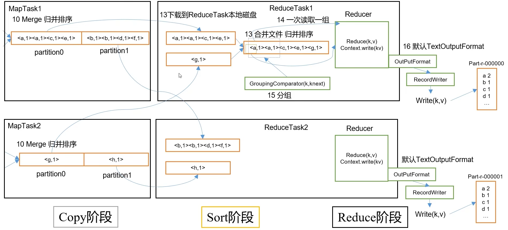
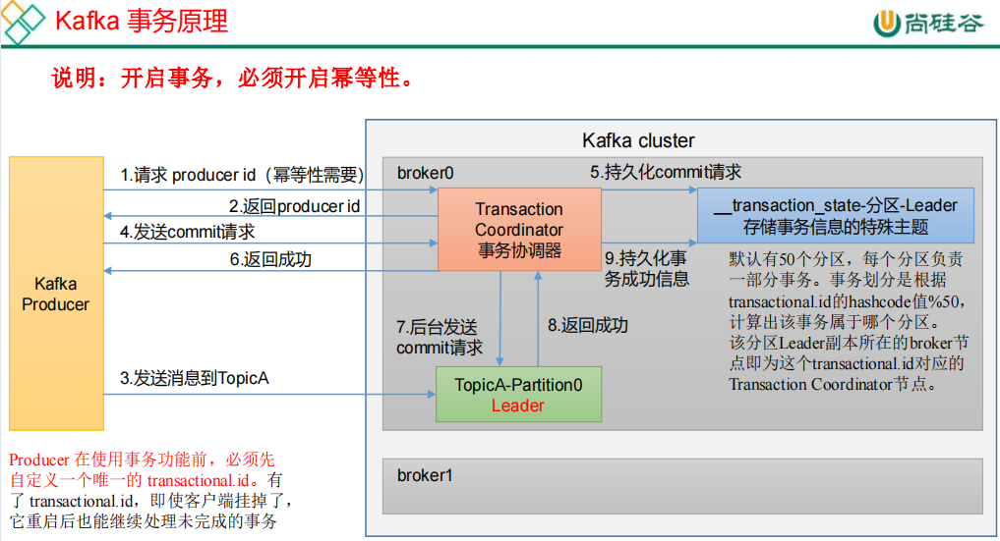

# 大数据

> 大数据的关键词：
>
> ​		吞吐量，延迟，并发，传输速度，io，容错性，扩展性，可靠性，健壮性，持久化，弹性扩展。

容错：允许集群的节点出现失败

可靠性：将消息根据策略进行磁盘的持久化

> 离线，实时
>
> 时效性。
>
> 数据一致性，


## 分布式：

分布式系统应用场景：

1. 云计算
2. 大数据处理：分布式文件系统
3. 区块链


分布式与集群的区别：

集群：多个人在一起做同样的事

分布式：多个人在一起做不同的事


分布式系统存在的问题：

1. 通信异常：网络延迟，异常等导致消息丢失和消息延迟
2. 网络分区：
3. 节点故障
4. 三态：成功，失败和超时


**分布式的一致性**
分布式**数据一致性**，指的是数据在**多份副本中**存储时，各副本中的**数据是一致的**。 

+ 强一致性： 要求系统写入什么，读出来的也会是什么，用户体验好，但实现起来往往对系统的性能影响大。但是强一致性很难实现 
+ 弱一致性： 在写入成功后，不承诺立即可以读到写入的值，也不承诺多久之后数据能够达到一致，但会尽可能地保证到某个时间级别（比如秒级别）后，数据能够达到一致状态。 
  + 读写一致性
  + 单调读一致性
  + 因果一致性
  + 最终一致性


分布式CAP理论：

C：Consistency，一致性，所有副本的数据一致

A：Availability，可用性， 系统持续正常运行并提供服务的能力 

P：Partition tolerance，分区容错性，系统遇到一些节点或网络分区故障时，仍然能正常提供服务

三选二：

CA：MySQL

AP：NoSQL，CoachDB，DynamoDB

CP：NoSQL，HBase,Redis


### 分布式一致性协议

+ 2PC协议：两阶段提交协议

1. 准备阶段
2. 提交阶段

+ 3PC协议


## 数据格式

1）AVRO

1. 主要是行存储
2. 设计的主要目标是为了满足schema evolution
3. schema和数据保存在一起

2）ORC

1. 由hadoop中RC files发展而来，比RC file更大的压缩比和更快的查询速度
2. Schema存储在footer中
3. 不支持schema evolution
4. 支持事务
5. 为Hive而生，很多组件不支持ORC
6. 高度压缩比并包含索引

3）Parquet

1. 与ORC类似，列式存储
2. Schema存储在footer中
3. 高度压缩比并包含索引
4. 比ORC的使用范围更广（更多组件支持）


如何选择：

1. 读写速度
2. 按行读多还是按列读多
3. 是否支持文件分割
4. 压缩率
5. 是否支持schema evolution


## 离线计算：

> 离线计算一般指通过批处理的方式计算**已经存储至文件，数据库的数据**（不会产生变化）。
>
> 特点：
>
> + 数据不会发生变化
>
> + 计算量级较大，保存时间长
> + 计算时间较长
> + 对时效性不敏感

场景：

计算前一天积累的日志在凌晨进行计算。


## 实时计算：

> 实时计算一般是通过流处理方式计算当日数据（正在产生的数据，源源不断产生）。
>
> 这种数据是会发生变化的。
>
> 准实时计算，采用的框架是Spark等，微批次进行处理。
>
> 特点：
>
> + 局部计算【以单条，微批次，小窗口数据范围进行计算】
> + 消耗资源成本高【24小时不间断运行】
> + 时效性
> + 可视化性
> + 开发成本【不能写sql，需要写代码】
>
> 

实时计算不能基于全部数据进行统计排序分组，只能对小窗口，微批次进行排序。


## 算法海量数据快速查询

### 1.BitMap


```java
import java.io.*;
import java.util.*;

public class BitMapSolution {
    private BitSet bitset;

    public BitMapSolution() {
        // 创建一个长度为 2^32 的位图
        this.bitset = new BitSet(1 << 32);
    }

    public void insert(int num) {
        // 将位图中第 num 位设置为 1，表示该数字存在
        bitset.set(num);
    }

    public boolean contains(int num) {
        // 查询位图中第 num 位的值
        return bitset.get(num);
    }

    public static void main(String[] args) {
        BitMapSolution bitMap = new BitMapSolution();

        // 示例：插入一些随机整数
        Random rand = new Random();
        for (int i = 0; i < 1000000; i++) {
            int num = rand.nextInt(Integer.MAX_VALUE);
            bitMap.insert(num);
        }

        // 示例：查询某个数是否存在
        boolean exist = bitMap.contains(42);
        System.out.println("Number 42 exists: " + exist);
    }
}

```


### 2.布隆过滤器

类似于一个HashSet，用于快速判断某个元素是否存在于集合中

缺点：

布隆过滤器不能保证100%正确，但是他的插入和查询效率都很高


## 数据倾斜

参与计算的数据分布不均，某个key值或某些key的数量远超其他key，导致在shuffle阶段，大量相同key数据发往同一个reduce，导致其reduce时间远超其他reduce。

发生数据倾斜时，虽然其他数据任务完成了，但是有一个未完成，这些资源也不能帮助未完成任务计算，**影响并行**。

也有可能OOM


# 数据库


## 范式理论

第一范式：**属性不可分割**，好处

第二范式：不能存在**部分函数依赖**，好处：减少数据冗余

第三范式：不能存在**传递函数依赖**，好处：减少数据冗余，增加数据一致性


## OLTP(联机事务处理系统)：

>  与功能、业务强相关的事务查询系统，要保证高并发场景下低时延的查询和处理效率，因此对CPU的性能要求较高 
>
>  存储的是业务数据，记录某类业务事件的发生，such as : 下单，注册，支付等等 
>
>  代表：mysql
>
>  **数据量相对较少，是GB级别的，面向业务开发人员** 

特点：

+ 规范化的
+ 行式存储
+ 为单条记录的查询做优化
+ 面向业务开发人员


结构化数据，半结构化数据.....

事务

acid

一致性


## 分布式锁

悲观锁：

认为会发生冲突，所以使用悲观锁会**对资源加锁**，其他事物需要读或修改时会被阻塞，只有人家用完解锁后，其他事务才能继续进行读写


乐观锁：

认为发生冲突概率较低，在读取或修改数据时不直接加锁，而通过版本号或时间戳去判断数据是否被其他事务修改。当一个事务需要更新数据时，首先读取数据的版本信息，并检查版本信息是否改变来判断是否发生了并发冲突。

>乐观锁适用于对数据的并发读操作较频繁的情况，因为它不需要加锁和阻塞其他事务，可以提高并发性能。但是如果并发冲突较多，乐观锁会引发锁竞争问题，需要进行重试或回退策略。

总结： **悲观锁**是一种保守的并发控制策略，适合并发写操作频繁的情况，但**可能导致性能下降**。**乐观锁**是一种乐观的并发控制策略，适合并发读操作频繁的情况，可以**提高并发性能**。选择何种锁策略应根据具体业务场景和并发访问模式进行权衡。


1）基于数据库实现

2）基于redis缓存实现

3）基于zookeeper实现


时间

mysql中使用timestamp，默认值为当前时间

使用datetime，默认值是null


## 数据库和数据仓库的比较：


**数据库侧重 事务和查询**

**数据仓库侧重于分析。**

> 数据库用于快速事务处理和实时查询，而数据仓库用于综合分析、历史数据分析和复杂查询 

为什么需要数据库：

1. **事务处理**：数据库主要用于支持事务处理（OLTP），它们专注于实时的数据录入、更新和查询。数据库设计和优化针对高并发、低延迟的操作，更适合支持日常的业务活动和交易处理。
2. **实时查询**：数据库通常用于快速的实时查询，提供即时的响应时间，以满足对当前数据的操作和分析需求。


为什么需要数据仓库：

1. 综合性分析： 数据仓库是一个综合的数据存储解决方案，用于集成和整理来自多个数据源的数据 ，提供海量数据的支持
2. 历史数据分析：存储了历史数据，便于用户在时间上分析。
3. 复杂分析需求：数据仓库支持复杂查询、多维分析和高性能数据挖掘。它们提供了强大的聚合、切片和钻取功能，以更好地理解和利用数据。

> 简化就是，数据仓库提供历史数据，和多个数据源的数据并支持复杂功能进行数据分析。


## 关系型数据库和非关系型数据库的区别


# 数据仓库

存储多种数据源【业务数据，爬虫】数据的中心存储系统（包括历史数据和当前数据），

存储大规模数据的中心存储系统，用于支持决策和分析的数据存储解决方案。

数仓是BI（商业智能）的核心组件。


ods数据是从不同数据源通过ETL加载进去的


etl工具：

spark，kettle

flume，hive也算半个【因为确实可以做一些etl】

flink


## 基础概念

存量：系统在某一时间的存有数量

本期末存量=上期期末存量+本期内增量

流量：在某一段时间内流入\流出系统的数量

增量：在某一段时间内系统中存有数量的变化。

>存量是在某一时刻的总量，存量一般设计成拉链表（月报（常用）；日报）
>
>流量和存量的区别：流量是增量；存量是总量。

### 四类表

1. 全量表

**全量表没有分区**，表中数据是前一天的所有数据，每次向全量表里写数据都会覆盖之前的数据，所以**全量表不能记录历史的数据情况**，只有截止到**当前最新的，全量的**数据。

2. 快照表

快照表是有时间分区的，对当前时刻的所有数据进行快照存储，后续内容不变【全量表数据后续会发生变化】

比如当前数据表有3个分区，24号、25号、26号，其中，24号分区里面的数据就是从历史到23号的所有数据;25号分区里面的数据就是从历史到24号的所有数据，以此类推。

缺点：
 这种存储方法导致每个分区都存储了许多重复的数据，尤其在数据量大的时候，就会非常的浪费存储空间。

3. 增量表

记录每天新增数据的表，只报变化量，没有变化的不用报。

每个分区存在的都是前一天数据的变化内容。

4. 拉链表

 维护历史状态，以及最新状态数据的一种表，是分区表。


## 数仓分层

ADS（Application Data Store）：这些数据应是高度汇总的，可以直接导入到应用服务去使用

DWS（DataWareHouse  Summary）

DWD（DataWareHouse Detail）

ODS（Operation Data Store）：操作数据层，源数据层


## OLAP(联机分析处理系统)：

> 存储**多业务历史**数据，支持复杂的分析操作，侧重决策，并且提供直观易懂的查询结果。
>
> 代表：
>
> hive，clickhouse，elasticSearch
>
> **数据量大，常规是TB级别的，面向分析决策人员** 

特点：

+ 为大规模分析查询做优化
+ 列式存储
+ 面向分析师

## 模型方法论

### ER模型

实体-关系模型，遵循范式，冗余性低，但是查询时会


事实表：

设计事实表的四个步骤：

选择业务过程->声明粒度->确认维度->确认事实


 事实表是数据仓库中存储**度量数据**（measurements）的主要表 ，其数据一般是可变的。

> 简单讲：
>
> 事实表=维度主键作为外键+度量值
>
> 维度表 = 维度主键 + 维度信息

> 事实表存储了度量数据，用于度量和计量业务过程，而维度表存储了描述性数据，提供了上下文和筛选条件。它们通过关联和共享键来构建数据仓库中的数据模型，支持复杂的数据分析和报告。 

> 事实表：
>
> + 事务事实表【增量同步】
>
> + 周期快照事实表【全量同步】
>
> + 累积快照事实表【全量同步】
>
> 【后面这两个表可能存在也可能不存在，这俩是解决事务事实表缺点的方案】

维度表：

 维度表是数据仓库中存储业务过程中的**描述性数据**（descriptive data）的表 ，数据通常是静态的，不经常发生变化。


> 维度退化： 指的是直接把一些简单的维度放在事实表中 


### 统计指标

原子指标：事实表中的度量值【不可再拆解的指标】

原子指标三要素：业务过程，度量值，聚合逻辑

派生指标：原子指标+统计周期+统计粒度+业务限定

衍生指标：在一个或多个派生指标的基础上，通过各种逻辑运算而成的，**例如比例，比率等类型的指标**


### 维度模型


### 1.1星型模型

 当所有维表都直接连接到 **“事实表”** 上时，整个图解就像星星一样，故将该模型称为星型模型 。

> 星型架构是一种**非正规化**的结构，多维数据集的每一个维度都直接与事实表相连接，**不存在渐变维度**，所以**数据有一定的冗余**。 


### 1.2雪花模型


### 1.3星座模型

又称星系模型


## 三范式建模和维度建模有什么区别

三范式**基于关系型数据库的范式理论**而设计的，追求数据的无冗余性和高一致性。

维度建模是一种针对数仓和分析需求的建模方法

1. 维度建模冗余性高，三范式冗余性低
2. 维度建模冗余高，**适合进行分析和查询**，三范式适合事务处理，增删查改，**更关注数据一致性和完整性**。


## 什么是业务过程

**业务过程是企业活动中的事件**，如下单、支付、退款都是业务过程，业务过程是**一个不可拆分的行为事件**。 


## 为什么要分层

https://baijiahao.baidu.com/s?id=1771016309102798991&wfr=spider&for=pc

1. 使数据结构更加清晰，把复杂问题简单化【每层只需要处理对应的内容即可】
2. 数据复用，减少重复开发【空间换时间】
3. 数据血缘追踪，出现问题时，可以快速定位到问题发生的表是哪个来源产生的【数据来源多，但是不同来源放在对应源表】


## 为什么出现数据仓库，和数据库的区别是什么

因为OLTP系统的核心是面向业务，支持事务的。数据库存储数据较少【仅存数周或数月的数据】，数据分析也是对数据进行读操作，使数据库压力大增。

为了更好的进行各种规模的数据分析，同时也不影响OLTP系统运行，**需要构建一个集成统一的数据分析平台**。

> 简化：
>
> 数据库存储数据少，并且分析也会给数据库压力，所以自立门户


当数据量较小时，可以选择oltp数据库直接分析，但是数据量大时，数据库的压力大还不方便。


二者区别就是：

数据库面向事务设计，一般存储业务数据，为捕获数据而设计。

数据仓库面向主题设计，一般是存储历史数据，为分析设计


# 离线项目


## 离线架构


# 实时项目

## spark实时架构


### 亮点：

1）使用redis存储offset，使消费数据时可以指定消费位置进行消费

2）在数据流过来后，使用阿里的fastjson将流数据转化为JSON对象 JSON.parseObject(value)

3）采用解耦的方式，将中间变量存放在配置文件中，不至于牵一发而动全身

4）实现精确一次消费：

> 同时解决数据丢失和数据重复，即可实现了精确一次消费。
>
> 自动提交offset，默认5s一次提交，但是无论先提交offset还是写出数据都会出现重复消费或漏消费

1. 将提交offset和写出数据做出事务，进行原子绑定

   ​	前提是利用**关系型数据库**的**事务**进行处理

2. 后置提交offset【至少一次消费】 + 幂等

   ​	后置提交需要手动提交偏移量

5）缓冲区问题

1. kafka默认使用异步发送的方式，kafka的生产者会先将消息发送到缓冲区【RecordAccumulator】，当缓冲区写满或到达指定时间，才会将缓冲区数据写到broker。
2. 消息发送到缓冲区中还未写到broker【但此时认为数据已经成功写给kafka】，然后会手动提交offset，如果offset提交成功，但kafka集群故障，缓冲区数据就会丢失。【 如果消息中间件在接收消息之前发生故障，或者在接收消息后未能正确处理消息，那么消息有可能丢失。即使生产者成功发送消息并收到ack，但如果消息中间件在后续处理过程中出现问题，消息也可能丢失 】

解决方法：

1. 改为同步，性能下降【一般不用】
2. 在手动提交offset之前，强制将缓冲区的数据flush到broker中，一个rdd分区后的一批数据，大小可能会超过16kb（缓冲区自动刷），也可能不会超过（轮到  强制flush 生效）
3. 造成这个的原因是手动提交offset+异步导致的【原本数据达到batch.size或时间到了才会sender数据，再提交offset，现在是还未sender就提交offset】（不一定正确）

> 此时是消费端消费时手动提交offset，消费的数据又作为生产者发送给kafka【这时候是有缓冲区】

6）状态数据还原

因为数据是存储在redis中，然后再写入es的，那么存储redis后，写es时候程序挂掉，通过代码可知，此时因es写入失败，**offset暂未提交**，但是下次重启后触发数据的重试，**redis存在该数据，所以被过滤（但是es未写入）**。

解决方案：

1. 事务【不推荐】
2. 在项目开启时，向es中同步一份数据给redis。


7）双流Join

两个流数据是独立保存，分批次传输，可能存在分布在不同的批次，简单join就会丢失掉不同批次的数据。

解决方案：

1. 增大采集周期【还是会出现那种情况】

2. 利用滑动窗口进行join，然后再进行去重
3. 把数据存储缓存，关联时进行join后，再去查询缓存中的数据，来弥补不同批次的问题。


8)采用批量写入es，减少IO次数提高写入性能和OLAP数据内部的小文件生成。


### 日志文件

> 通过flume对数据进行采集，传送给kafka


日志数据是用户启动，浏览页面，点击等产生的

通过对对象类型的判断进行分流，错误日志是没有公共字段的，他可以直接传递到下游错误日志Topic，其他数据需要封装为对象再用Json.toJsonString发送


在数据转换前，提取本次流中offset的结束点，后面一步才是转换数据结构

```scala
var offsetRanges: Array[OffsetRange] = null // driver
 kafkaDStream = kafkaDStream.transform( // 每批次执行一次
 rdd => {
 println(rdd.getClass.getName)
 offsetRanges = 
rdd.asInstanceOf[HasOffsetRanges].offsetRanges
 rdd
 }
 )
```


### 业务数据

> 业务数据一般是从数据库中进行同步，使用maxwell


### dwd到dws层数据处理概要

数据的聚合操作一律交给olap完成【离线操作还是交给hive等完成】，但是olap数据库不是特别方便或者性能不好的操作，比如说Join操作，等可以交给实时计算完成


## Flink实时项目

对于DIM的处理和存储

> DWS层使用ClickHouse
>
> ADS不落盘，实质上是接口模块中查询ClickHouse的SQL语句


DIM过滤出所需要的表【实现灵活更改所需表，不重启任务】


> 将配置信息存储到mysql中，然后使用Flink CDC监控表变化（binlog），然后再通过广播流


## 为什么实时处理的OLAP不用hive，而是es等

实时处理的OLAP（联机分析处理）系统通常需要**快速地处理和查询**大量的数据，并且对**查询响应时间有较高的要求**。相比较而言，Hive主要是建立在Hadoop上的一种数据仓库解决方案，其设计目标更多地侧重于批处理作业。

以下是使用Elasticsearch（ES）和ClickHouse而不是Hive的一些原因：

1. 性能：ES和ClickHouse都被设计为快速、高效的数据存储和查询引擎。**ES使用倒排索引和分布式架构**来加速搜索和聚合操作。**ClickHouse则专注于列存储和向量化查询**，能够提供出色的查询性能和压缩比。
2. 实时数据处理：**ES和ClickHouse都支持实时数据的写入和查询**。**ES具有实时索引更新的能力，适用于需要快速响应查询以及对实时数据进行分析和可视化的场景**。ClickHouse也可以在数据写入时提供近乎实时的查询能力。
3. 灵活性：ES和ClickHouse都具备灵活的数据模型和查询语言。ES支持全文检索、聚合分析和地理空间查询等功能。ClickHouse则支持复杂的多维分析查询，可以进行高效的聚合和窗口函数处理。


# MySQL

SQL语言：

1. DDL（Data Definition Language）：DDL 用于定义和管理数据库的结构，例如创建、修改和删除数据库、表、索引、视图等。常见的 DDL 命令包括 **CREATE（创建）、ALTER（修改）和DROP（删除）**。DDL 语句执行后会立即生效，并且会自动提交事务。
2. DML（Data Manipulation Language）：DML 用于操作和处理数据库中的数据，例如插入、更新、删除和查询数据。常见的 DML 命令包括 **INSERT（插入）、UPDATE（更新）、DELETE（删除）和SELECT（查询）**。DML 语句需要通过事务来进行管理，可以使用 COMMIT 提交或 ROLLBACK 回滚来确保数据的一致性和完整性。
3. DCL（Data Control Language）：DCL 用于管理数据库用户访问权限和安全性。DCL 命令包括 **GRANT（授权）、REVOKE（撤销权限）**等，用于控制用户对数据库对象的访问权限，以确保数据库的安全性。
4. TCL（Transaction Control Language）：TCL 用于管理数据库事务的提交和回滚操作。**TCL 命令包括 COMMIT（提交事务）、ROLLBACK（回滚事务）**等，用于确保事务的一致性和完整性。


## sql语句的执行顺序

from > where>group>having>order>select

join>where 

## sql的执行流程


> MySQL 8.0 版本后删除了缓存的功能，官方也是认为该功能在实际的应用场景比较少，所以干脆直接删掉了。 

1）客户端与sql服务器建立连接，账号认证和校验权限

2）客户端发送查询sql给服务器

3）服务器检查 **查询缓存**，如果命中，立刻返回缓存结果，否则进入下一阶段

4）服务器端进行sql解析，预处理，再由优化器生成对应的执行计划。

5）MySQL根据优化器生成的执行计划，再调用存储引擎（MyISAM，InnoDB）的API来执行查询。

6）将结果返回给客户端


> 解析器：
>
> 1）此法分析
>
> 2）语法解析【判断sql是否满足mysql语法】
>
> ​	根据sql语句生成一个数据结构，把他叫做解析树


## 为什么8.0的查询缓存被删除了

1. 缓存命中率不高，严格要求sql语句前后一致，有一点区别就会不能命中
2. 缓存过期，对数据更改等操作都会导致缓存过期，下次需要重新加载


## mysql的写入流程

https://www.bilibili.com/video/BV1Kg411z7RS/?spm_id_from=333.337.search-card.all.click&vd_source=c16d38f4f5167617575f8b4d3f97c1ec

在mysql执行SQL后进行更改和插入，将执行修改或插入的数据写入到undo log【提供回滚】，然后将数据更新到buffer pool中，后续特定时机，客户端读写数据从buffer pool中读取，再开启io线程，将数据刷新到磁盘中，但是这个过程断电等问题丢失数据，所以提供redo log buffer将数据异步同步过来，提交事务后刷新到redo log，供其开机使用同步数据


## MySQL读流程

mysql读取数据是以页为单位读取的【16kb】，将这页数据加载到buffer pool中。

查数据时，如果没设置索引，那么将会走**全表扫描**


## 为什么InnoDB存储引擎选择使用B+tree索引结构

+ 相对于二叉树，**层级更少**，搜索效率高
+ 对于B-tree，无论是叶子节点还是非叶子节点，都会保存数据，这样导致一页中存储键值减少，指针跟着减少，要同样保存大量数据，只能增加树的高度，导致性能降低
+ 相对Hash索引，B+tree支持**范围匹配及排序操作**


> 只有叶子节点存储数据，父节点都是存放的索引，所以对应存储的数据更多

**双向指针**

## B+tree索引结构的特点是什么

所有叶子节点才存放数据，非叶子节点存放的是索引，加快查询

叶子节点形成了双向链表

## 为什么查询时对主键进行条件查询会比非主键快

mysql中索引分为聚集索引和二级索引，而聚集索引是以主键索引作为聚集索引。非主键查询需要走二级索引，然后再回表查询，经过聚集索引找到自己需要的行数据


> 如果不建立索引，那么就会进行全表扫描，哪怕只有一行数据，也要进行全表扫描
>
> 如果数据量过多，那么创建索引会耗时更多

## 事务实现的原理

事务的特性acid，其中：

+ 原子性是指数据修改失败后会回退到修改前的状态，原子性的实现依赖于undo log 回滚日志实现，他记录了修改前的数据
+ 一致性：从设计表方面，mysql提供了外键，数据类型等约束，从底层看，因为undo log，redolog 回滚和重写日志，保证数据可以正确的存储
+ 隔离性：InnoDB采用rr（可重复读）的隔离机制， 使用加锁（幻读）和mvcc实现（脏读和不可重复读）的
+ 持久性：通过redo log 实现，在开启事务时，将数据异步写入到重写日志缓冲区中，提交事务时刷新到重写日志【buffer pool是缓存的数据页，需要等待特定的时机【 一部分脏页会被缓存在Buffer Pool中，不立即刷新到磁盘，以提高性能。只有当满足一定条件（例如空闲IO或者脏页比例达到一定阈值）时，才会将脏页刷新到磁盘 】才能刷新到磁盘，而重写日志缓冲区则在提交事务时即可刷新】


> 隔离性：mvcc，通过版本链，实现多版本，可并发读写，写读，通过readview生成策略的不同实现不同的隔离级别

一致性是基于aid实现的


## 对于脏读，不可重复读，幻读，mysql是怎么解决的

mysql默认使用可重复读的事务隔离级别。

> 四种事务隔离级别：
>
> 1. 读未提交
> 2. 读已提交
> 3. 可重复读
> 4. 串行化

脏读和不可重复读是使用mvcc（多版本并发控制）解决的，使用快照读可以解决不可重复读。

使用行锁和表锁的方式实现了幻读的问题


## 什么场景下不推荐使用自增id作为主键

+ **数据量多需要分库分表**
+ 经常会遇到数据迁移的情况
+ **新数据需要和老数据进行合并**


## 为什么不推荐uuid作为主键

mysql中的二级索引会有多个，而二级索引的叶子节点也都是**存储的主键id**，主键越长，将会占用大量的磁盘空间，搜索时会耗费大量的磁盘io【 通过读取磁盘上的不同块来获取所需的数据。而磁盘的随机读写速度相对较慢，因此会产生较大的磁盘 I/O 开销 】


如果是乱序插入会导致页分裂现象，而且长度较长，消耗大量磁盘io


## mysql自增id用完了会怎样

自增id最大存储的数据量是20多亿【int类型主键】，后续id不会再递增，导致主键冲突

1. 使用bitint类型自增
2. 使用业务主键，对后续的分库分表操作时更加方便

> 单表数据量太多时就该分表了，单表一般是到不了20多亿的数据


## 为什么使用b+树而不是b树

b树特点：

+ 节点排序
+ 一个节点可以有多个元素，多个元素也排序

一个节点有多个元素，意味着树的高度不会太高

b+树是b树的优化，因为b树的查询效率太低，b+树只有叶子节点才能存储数据，而非叶子节点都是**存储的索引**，**加快查询速度，并且叶子节点之间含有指针**，很好的支持全表扫描

b+树冗余了一些索引数据

b+树特点：

+ 一个节点有多个元素，意味着树的高度不会太高
+ 非叶子节点都是**存储的索引**，**加快查询速度**
+ 叶子节点之间含有指针【**双向指针**】，很好的支持全表扫描


每个节点是InnoDB的页数据


## 慢查询该如何优化

+ 使用explain查看执行计划，检查是否走了索引，如果没有，则试试索引

+ 如果用了索引，根据业务判断是否可以使用覆盖索引

+ 检查表中的数据是否过多，是否应该进行分库分表

+ 是否是节点资源问题，适当增加资源

  


## 主从复制

### 应用场景：

+ 数据库的**热备**
+ 分离：主数据库只负责写入操作，从数据库负责查询工作

### 原理：

1. master主库记录数据变更记录，写进binary log（二进制日志）中

2. slave从库向master发动dump协议，开启一个线程从主库读取bin log文件，拷贝到slave的中继日志（relay log）
3. 又开启一个线程将中继日志的数据同步到自己的数据库。


### binlog：

采用分片+索引（快速定位）

二进制日志包括两类文件：二进制日志索引文件（.index后缀），二进制日志文件（.0000*后缀）

mysql中binlog的格式：

statement | mixed | row


# maxwell

简介：

Maxwell 是由美国 Zendesk 公司开源，用 **Java 编写**的 MySQL 变更数据抓取软件。它会**实时监控 Mysql 数据库的数据变更操作**（包括 insert、update、delete），并将变更数据以 JSON格式发送给 Kafka、Kinesi 等**流数据处理平台** 。

## 原理

将自己伪装成slave，并遵循mysql主从复制的协议，从master同步数据


## 数据格式

maxwell可以进行增量同步，也可以使用maxwell-bootstrap进行全量同步

### 全量同步

>第一条 type 为 bootstrap-start 和最后一条 type 为 bootstrap-complete 的数据，是 bootstrap 开始和结束的标志，不包含数据，中间的 type 为 bootstrap-insert 的数据才包含数据。
>
>**一次 bootstrap 输出的所有记录的 ts 都相同，为 bootstrap 开始的时间。**

```json
{
 "database": "fooDB",
 "table": "barTable",
 "type": "bootstrap-start",
 "ts": 1450557744,
 "data": {}
}
{
 "database": "fooDB",
 "table": "barTable",
 "type": "bootstrap-insert",
 "ts": 1450557744,
 "data": {
 "txt": "hello"
 }
}
{
 "database": "fooDB",
 "table": "barTable",
 "type": "bootstrap-insert",
 "ts": 1450557744,
 "data": {
 "txt": "bootstrap!"
 }
}
{
 "database": "fooDB",
 "table": "barTable",
 "type": "bootstrap-complete",
 "ts": 1450557744,
 "data": {}
}
```


### 增量同步

如果有更改操作，那么数据格式会出现old字段，存储更改的数据字段


# Hadoop

## HDFS

### 小文件归档

使用hdfs存档文件或HAR文件归档，是一个更高级的文件存储工具，将文件存入hdfs块，【对于索引信息，合并为一个文件，逻辑合并】，内部实际还是多个小文件


## MapReduce

> 分区注意事项：
>
> 如果使用自定义分区时，需要设置ReduceTask的个数，不然默认ReduceTask为1，会走默认的分区器
>
> reduceTask的个数要>=分区数（设置1不报错，但是底层是走的默认分区器，而不是自定义的），如果reducetask个数多了，那么开启节点占用资源还不工作，浪费资源


### MapReduce的工作流程


> 如果使用Combineinputformat，可以再切片生成之前，将小文件合并成一个或多个更大的切片

1. 客户端在submit前对文本进行切片Split

2. submit提交信息3种

   + 切片
   + jar包【本地模式下不用将jar包分给其他节点】
   + Job.xml配置文件

3. YARN开启ApplicationMaster，读取切片信息，开启对应个数的MapTask

4. TextInputFormat通过RecorderReader【还有另一个方法，作用是判断该文件是否可以被切割】按行读取数据kv，k是偏移量，v是一行数据

5. 将kv传给mapper，经过一系列操作并输出到环形缓冲区（内存中）

   > 环形缓冲区默认大小100M，一部分存储数据，一部分存储索引（元数据，索引，分区号，keystart等），写入到80%进行反向写入【开启溢写，防止写入100%时候等待】，在写这20%时就有可能写入磁盘完成，效率提高，未完成就阻塞

6. 在溢写前，对每个分区的数据按照key的元数据的索引进行**快排**

7. combiner合并（将<a,1><a,1>这种合并为<a,2>）【非必要的，可以不做，减少reduce压力】

8. 80%时将数据**溢写到文件**（分区且区内有序）

9. **Merge归并排序**（将多个map产生的文件以分区号进行合并排序，对已经有序的文件排序最快的是归并排序）

10. combiner合并（将<a,1><a,1>这种合并为<a,2>）【非必要的，可以不做，减少reduce压力】

-------------------Reduce开启------------------

10. 所有MapTask任务完成后【不绝对，根据配置有时可以提前开启reducetask】，启动相应数据量ReduceTask，并告知ReduceTask处理数据范围（数据分区）

11. 将MapTask的数据下载到ReduceTask本地磁盘，并将**同一分区的数据进行合并**+**归并排序**
12. 一次读取一组数据（<a,1>,<a,1>，<a,[1,1]>）
13. 经过Reducer进行处理，默认按照TextOutputFormat输出到文件

### MapTask工作机制

> 1-4是客户端要做的，从5开始时read阶段


merge阶段：将所有临时文件进行一次合并，最终只生成一个数据文件output/file.out中，同时生成相应的索引文件output/file.out.index


### ReduceTask工作机制

> ReduceTask是主动拉取数据的



ReduceTask的个数需要通过测试来设置，根据集群性能而定

ReduceTask=0，表示没有reduce阶段，输出文件个数和Map个数一致。

全局有序时需要设置reduceTask=1

如果分区数不是1，但是reduceTask为1，根据源码，执行分区前先判断reduceNum个数是否大于1，不大于1不执行自定义分区


### 讲一下Shuffle机制

shuffle是map之后，reduce之前的数据处理过程称为shuffle

> 每个Map都有合并分区，此处合并的不是多个Map的分区，而是溢写出多个文件进行合并分区。

分区 是 调用了 getPartition（）方法


### MapTask并行度由什么决定

+ 数据块：Block是**HDFS物理上**分块（block是hdfs存储数据单位）
+ 数据切片（Split）：在逻辑上对输入进行分片，并不会在磁盘上将数据切分成片进行存储。数据切片是MapReduce程序计算输入数据的单位

一个切片/block会对应启动一个MapTask

默认切片大小=blockSize

> 切片大小设置为非128M时，因为数据块默认大小128m，切片会导致 数据块的部分 数据被其他节点处理，这个过程又涉及到网络io等，效率不好
>
> 设置数据块大小，或者调整切片的大小（如果是小于1.1倍，那么就没必要再切分了），**防止小文件过多**

Tips：

切片是针对单一文件的，而不是数据集整体【两个文件的小切片不能放到一起处理】

切片时实现CombineFileinputFormat，处理小文件时，可以将这些数据合并为大文件再处理


### MR的数据倾斜如何解决


1. 检查是否是key的空值过多造成的数据倾斜，过滤空值或者自定义分区，将空值加随机数打散，聚合后，在舍弃随机数进行二次聚合
2. 设置使用combineTextInputFormat，将小文件进行合并
3. Map Join，小表join大表，将小表合并，job.addCacheFile( url )
4. 使用Combiner将数据在map端预处理
5. 设置多个reduce个数，增加并行度


### MR跑的慢的原因可能有哪些

1. 计算机硬件性能可能不行
2. 小文件过多
3. 数据倾斜
4. Map运行时间太长，导致Reduce等待过久

优化：

+ 自定义分区，减少数据倾斜
+ 减少溢写次数，提高环形缓冲区大小为200M，90%再进行溢写（减少文件生成）
+ 压缩
+ 调整MapTask和ReduceTask的内存和CPU核数等


## YARN

介绍：

YARN是一个**资源调度平台**，负责为运算程序提供服务器运算资源

### 有哪些组件

1. ResourceManager
2. NodeManager
3. ApplicationMaster
4. Container


ResourceManager：

1）处理客户端请求

2）监控NodeManager

3）启动或监控ApplicationMaster

4）**资源的分配与调度**  

NodeManager：

1）管理单个节点上的资源

2）处理ResourceManager的命令

3）处理ApplicationManager的命令

ApplicationMaster：

1）为应用程序申请资源，并分配给内部的任务

2）任务的监控与容错

Container：

封装了某个节点的多维度资源，如CPU，内存，磁盘等


### YARN的工作机制


1. 客户端申请一个应用application
2. yarn返回**应用idapplication_id**和**资源提交路径**等
3. 客户端上传job资源（切片，jar包，xml配置文件）
4. 资源提交完毕，申请ApplicationMaster
5. ResourceManager根据调度器（看是否有资源），创建容器，并下载job资源
6. ApplicationMaster根据jar包代码，申请运行MapTask容器
7. ResourceManager创建容器后，AM发送程序启动脚本（启动MapTask）
8. MapTask运行完后，AP向RM申请两个容器，运行ReduceTask
9. reduce向Map获取相应分区的数据进行处理
10. 程序运行完成后，MR会向RM注销自己


### YARN的调度器和调度算法

1. FIFO调度器（先进先出）
2. 容量调度器（Capacity Scheduler，Yahoo开发）
3. 公平调度器（Fair Scheduler，Facebook开发）


# Hive

应用场景有哪些：

数据挖掘，非实时分析，数据汇总，数据仓库


> 是一个基于Hadoop的HDFS组件的数据仓库工具，提供了类似于SQL的查询语言，便于开发。

## 讲述一下hive的架构原理

Driver，metaStore


> 用户通过beeline或jdbc等连接hive【本地模式不需要通过HiveServer2】
>
> 1.用户建表create table
>
> 2.metaStore记录对应路径
>
> 3.metaStore映射表关系【记录hdfs的路径映射】
>
> 4.用户编写hql语句发送给服务器
>
> 5.服务器进行一系列解析，优化，执行。
>
> 6.将计算结果返回


client提交hql语句，hive解析，引擎spark执行，yarn调度，hdfs存储。


## hive中提供了哪些数据类型

+ 原生数据类型
+ 复杂数据类型

原生数据类型：

1. 数值类型，tinyint，smallint，**int**/integer，bigint，float，**double**，decimal，numeric，
2. 时间日期类型：**timestamp**，**date**，interval
3. 字符串类型：**String**,varchar,char
4. 杂项数据类型:Boolean,binary

复杂数据类型：

1. array数组
2. map映射
3. struct结构体
4. union联合体


## Hive读写机制

SerDe：是Serializer，Deserializer的简称，目的是用于序列化和反序列化。

序列化：将对象转换为字节码的过程

反序列化：将字节码转化为对象的过程


hive读数据时,"key"部分会被忽略，在写入key时，key始终是常数。**基本上行对象存储在“value”中**。

读数据过程：

hdfs files--> inputFileFormat --> <key,value> -->Deserializer-->Row object


写数据过程：

Row object -->Serializer --> <key,value> -->OutputFileFormat -->HDFS files

> row format + delimited/serde


## Hive的分区表有什么作用

**避免全表扫描，提高查询效率**

分区表是在原有表的基础上做出的处理，然后将处理的结果文件放到自定义的路径，该目录下只会存在满足条件的数据


> 分区字段不能是表中已经存在的字段

静态分区:手动指定

动态分区:根据表中数据自动推断出来的


单双分区表：

双分区表是分区字段有两个或两个以上，每一个字段都是一层目录文件夹


## 分桶表的作用是什么：

基于分桶字段查询，减少全表扫描

join时可以提高mr程序效率，减少笛卡尔积

**分桶表数据高效抽样**


## 分区和分桶的区别是什么

1. 分区是按照某个或几个列对数据进行垂直划分，将数据分散到不同的存储位置，以实现更快的查询。
2. 分桶是在水平方向上将数据划分成多个桶，以使每个桶中的数据量相同，提高查询效率

分区侧重数据的组织和管理，分桶则侧重于数据的查询效率

> 分区是将数据按照不同的目录进行存储
>
> 分桶是将数据划分为不同的文件进行存储


## Hive 中的几个排序


## HQL转换为MR流程

+ 解析器（SQLParser）：将sql语句转化为抽象语法树（AST）
+ 语义分析器（Semantic Analyzer）：将AST进一步抽象为QueryBlock（把每一个子查询划分为一个QueryBlock）
+ 逻辑计划生成器（Logical Plan Gen）：由QueryBlock生成逻辑计划
+ 逻辑优化器（Logical Optimizer）：对逻辑计划进行优化
+ 物理计划生成器（Physical Plan Gen）：根据优化后的逻辑计划生成物理计划
+ 物理优化器（Physical Optimizer）：对物理计划进行优化
+ 执行器（Execution）：执行该计划，得到查询结果并返回给客户端


> 逻辑计划（Logical Plan）是指从HiveQL查询语句转换到物理执行计划之前的中间步骤。它表示了查询语句的逻辑结构和操作流程，但并未考虑底层的数据存储和执行细节 


## Hive与数据库比较

只有语言，语法相近，其他方面差距都是比较大的

|          | hive                                                         | 数据库               |
| -------- | ------------------------------------------------------------ | -------------------- |
| 存储位置 | hdfs                                                         | 本地文件系统         |
| 数据更新 | 不建议更新【hdfs不支持修改】                                 | 需要经常修改         |
| 执行延迟 | 延迟高【但是当数据多的时候【超过数据库的处理能力】，hive并行处理速度快，优势明显】 | 一定量级以内，延迟低 |
| 数据规模 | 支持大规模的数据计算                                         | 规模小               |


## Hive可以做哪些优化

### 1）分组聚合时map-side减少shuffle

 Mapper聚合：在每个Mapper节点上，输入数据首先被预处理，并进行本地聚合。这样可以在Mapper节点上尽可能减少或合并相同键的记录，以减少后续的传输量。通常使用哈希表等数据结构来实现本地聚合 

>--启用 map-side 聚合，默认是 true
>set hive.map.aggr=true;


### 2)Map Join

> hive默认Join算法Common Join,通过一个MR完成一个Join操作

优化join最常用的map join，通过两个只有Map阶段的job完成一个join操作。

第一个job读取小表数据，制作为hash  table，并上传到hadoop分布式缓存（本质是hdfs）。

第二个job从分布式缓存中读取小表数据，并缓存到Map Task的内存中，然后扫描大表数据，在map端即可完成关联操作。【前提是 大表join小表的场景】


>--启动 Map Join 自动转换
>set hive.auto.convert.join=true;


### 3)SMB MapJoin

Sort Merge Bucket Map Join(SMB MapJoin)

要求：

+ 参加join的表均为分桶表，且分桶字段为Join的关联字段
+ 两表分桶数呈倍数关系
+ 数据在分桶内是按照关联字段有序的【满足后可以使用数据库中常用的算法之一Sort Merge Join】

>SMB Map Join 无需构建 Hash Table 也无需缓存小表数据，故其对内存要求很低。 
>
>适用于大表 Join 大表的场景


### 4)Reduce并行度

Reduce 端的并行度，也就是 Reduce 个数，可由用户自己指定，也可由 Hive 自行根据该 MR Job 输入的文件大小进行估算。

**如果reduce的个数不合理，那么就会导致 小文件过多**

还有以下影响：

1. 性能下降：Reduce任务的数量增加意味着更多的任务需要执行，这会增加整体作业的执行时间。每个Reduce任务都需要消耗计算资源和内存，而且还需要进行数据传输和合并操作。如果Reduce任务的数量过多，这些开销会变得更加显著，从而导致作业的性能下降。
2. 资源消耗增加：每个Reduce任务都需要占用一定的计算资源和内存。当Reduce任务数量较多时，整个集群的资源消耗会增加，这可能会导致资源不足的问题。如果集群无法为每个Reduce任务提供足够的资源，可能会导致任务的执行失败或延迟增加。
3. 数据倾斜：当Reduce任务的数量过多时，数据分布可能会变得不均匀，即数据倾斜问题。某些Reduce任务可能会收到比其他任务更多的数据，从而导致这些任务的执行时间明显延长，而其他任务则处于空闲状态。这会导致整个作业的执行时间增加，造成性能瓶颈。
4. 额外的网络开销：在Reduce阶段，数据需要从Map任务传递给Reduce任务。当Reduce任务的数量增加时，将会有更多的数据传输发生，这会增加网络开销。数据传输的频率和数据量将大大增加，可能导致网络拥塞和延迟。

> 资源消耗+，性能-，可能会数据倾斜，额外的网络开销

>若使用 Tez 或者是 Spark 引擎，Hive 可根据计算统计信息（Statistics）估算 Reduce 并行度，其估算的结果相对更加准确。

### 5)小文件合并

因为reduce并行度设置不合理【可能是自动估算有问题】，或导致

计算结果出现大量的小文件。

通过计算任务输出的平均大小进行判断，符合条件就会单独启动一个额外的任务进行合并

>--开启合并 map only 任务输出的小文件
>set hive.merge.mapfiles=true;
>--开启合并 map reduce 任务输出的小文件
>set hive.merge.mapredfiles=true;
>--合并后的文件大小
>set hive.merge.size.per.task=256000000;
>--触发小文件合并任务的阈值，若某计算任务输出的文件平均大小低于该值，则触发合并
>set hive.merge.smallfiles.avgsize=16000000;


### 6）谓词下推

尽量将过滤操作前移，以减少后续计算步骤的数据量

开启谓词下推后，无需调整sql语句，hive就会自动将过滤操作尽可能的前移动。

>--是否启动谓词下推（predicate pushdown）优化 
>
>set hive.optimize.ppd = true;

### 7)并行执行

默认Hive同时只会执行一个Stage，但是sql语句可能会包含多个Stage，其中有些Stage并非完全互相依赖，所以有些Stage是可以并行执行的


### 8）CBO优化

> CBO 是指 Cost based Optimizer，即基于计算成本的优化。
>
> 默认自动开启。

计算模型通过对同一SQL语句 计算不同 执行计划的计算成本，并使用

目前 CBO 在 Hive 的 MR 引擎下主要用于 Join 的优化，例如多表 Join 的 Join 顺序。

### 9）列式存储

采用ORC列式存储加快查询速度


### 10）压缩

通过压缩可以减少磁盘IO。


### 11）分桶和分表

1）创建分区表，防止后续全表扫描

2）创建分桶表，对位置的复杂数据进行提前采样

### 12）更换计算引擎

MR：

最多只有一个map和reduce操作，不能进行迭代计算，基于磁盘，落盘的地方比较多，【优点：虽然慢，但是一定能跑出结果】，**一般计算  周，月，年指标**

Spark:

基于内存，提供非常多的算子，map，fliter等，虽然在shuffle中也落盘【但是中间过程是不落盘的】，但是不是所有算子都需要shuffle，DAG有向无环图，兼顾了可靠性和效率，**一般处理天指标**

Tez：

1)**使用DAG描述任务**，好处：减少MR中不必要的中间节点，减少磁盘io和网络io

2）**资源动态调整**，任务运行时也可以根据具体数据量动态调整后续任务的并行度

> Tez并不是完全基于内存的框架。在处理大规模数据时，依然需要使用磁盘来存储和处理无法完全容纳在内存中的数据。特别是对于超过可用内存容量的数据集，Tez会基于磁盘进行溢写操作，以确保数据的完整性和有效的处理。 


### 13)对于几十张表join如何优化

优先考虑：

+ 数据是否可以过滤【过滤掉不需要的数据】
+ 减少join表的数量：在不影响业务前提下，对一些表进行预处理和合并，可以减少join操作。
+ 选择合适的join顺序：将小表放在前面可以减少中间结果的数据量，提高性能

+ 控制reduce任务数量【可以自己设置，也可以MR自动计算，估算出reduce数量，可能会导致小文件增多】


然后考虑  表的数据量 ：

小表join大表：

- 使用Map join：将小表加载到内存中，避免了reduce操作


- 使用Bucketed Map Join：
- 使用sort Merge Join：在map阶段完成排序，减少了reduce阶段的计算量


- 使用分区
- 使用压缩

## hive解决数据倾斜方法

定义：

参与计算的数据分布不均，某个key值或某些key的数量远超其他key，导致在shuffle阶段，大量相同key数据发往同一个reduce，导致其reduce时间远超其他reduce。【其他资源空闲但是不能释放，也不能帮那个未完成的reduce】

> 简化：某个key值数据太多，导致reduce时间太长。
>
> 想：
>
> 为什么不把倾斜的数据单独开一个mr，让其他资源开在另一个mr中，这样就可以提前释放资源了


> 判断任务是产生数据倾斜：
>
> 在yarn上可以看到任务的执行情况，如果其他任务都运行完了，都剩下这一个在运行就是数据倾斜。
>
> 如果剩余很多数据，可能就是程序有问题【排除数据量特别大，需要运行很长时间】


产生数据倾斜的场景：

+ 分组聚合
+ join操作

### 分组聚合导致的数据倾斜

> Hive 中的分组聚合是由一个 MapReduce Job 完成的。
>
> Map 端负责读取数据，并按照分组字段分区，通过 Shuffle，将数据发往 Reduce 端，各组数据在 Reduce 端完成最终的聚合运算。
>
> 若group by分组字段的值分布不均，就可能导致大量相同的key进入同一Reduce，从而导致数据倾斜。

1）判断倾斜的值是否为null

如果倾斜的数据是null，考虑是否可以过滤掉这种数据，如果不能过滤，给控制赋予随机值

```SQL
select * from log a left outer join user b on
case when a.user_id is null then concat('hive',rand()) else a.user_id end = b.user_id
```


2）Map-Side聚合

开启Map-Side聚合后，会在map端完成部分聚合工作，这样就**可能使原来倾斜的数据在初步聚合后不再发生倾斜**。

set hive.map.aggr=true;

`/* +mapjoin(a) */`:告诉hive，要将a表加载到内存中

```sql
select /* +mapjoin(a) */ a.id aid, name, age from a join b on a.id = b.id;
select /* +mapjoin(movies) */ a.title, b.rating from movies a join ratings b on a.movieid =b.movieid;
```


3）skew-GroupBy优化

> skew-GroupBy是Hive提供的一个**专门用来解决分组聚合导致的数据倾斜问题的方案**。

原理：

1. 开启两个MR任务
2. 第一个MR：按照随机数分区，将数据分散到Reduce，并完成部分聚合
3. 第二个MR：按照分组字段分区，完成最终聚合。


--启用分组聚合数据倾斜优化
set hive.groupby.skewindata=true;


### join操作导致

1）map join

使用map join 算法，join操作仅在map端就能完成，没有shuffle操作，没有reduce阶段【自然不会产生reduce端的数据倾斜】，**适用于大表join小表发生数据倾斜的场景**。【将小表加载到内存中，在map端直接处理】

2）skew join 

**适用于大表join大表产生数据倾斜的场景**，

原理：

1. 为倾斜的大key单独启动一个**Map Join**任务进行计算，其余key进行正常的Common Join。

> 大表处理：对于大表，Hive会按照正常的流程进行处理，但在遇到倾斜大键时，会触发单独的Map Join任务。这个任务将会将倾斜大键加载到内存中，并与小表进行Join操作 


3)调整sql语句


通过  添加随机数 + 扩容实现

> 扩容：
>
> 表b_1添加随机数1，表b_2添加随机数2，再union实现

```sql
hive (default)>
select * from(
	select --打散操作
		concat(id,'_',cast(rand()*2 as int)) id,value
from A
)ta
join(
select --扩容操作
    concat(id,'_',1) id,
value
from B
union all
select
concat(id,'_',2) id,
value
from B
)tb
on ta.id=tb.id;
```


## hive的数据中含有字段的分隔符怎么处理

Hive 默认的字段分隔符为 Ascii 码的控制符\001（^A），建表的时候用 fields terminated by '\001'。

> tips:
>
> ​		如果采用\t 或者\001 等为分隔符，需要要求前端埋点和 JavaEE 后台传递过来的数据必须不能出现该分隔符，通过**代码规范约束**。

​	一旦传输过来的数据含有分隔符，需要在前一级数据中转义或替换（ETL）。通常采用Sqoop和DataX在同步数据时预处理。


## 数据建模用的那些模型

1. 星型模型

   以事实表为中心，所有的维度表直接连接到事实表上。

   特点：

   ​	**维表只和事实表关联，维表之间没有关联**

   ​	每个维表主键为单列，且该主键放置在事实表中，作为两边连接的外键。

   ​	以事实表为中心，维表围绕核心呈星型分布

> 性能较好

2. 雪花模型

   对星型模型的扩展。

   **雪花模型的维度表可以拥有其他维度表的**

   雪花比星型模型更规范，但是维护成本高，性能低

3. 星座模型

   从星型模型延伸而来，星型模型是基于一张事实表，但是**星座模式是基于多张事实表的，而且共享维度信息**。


> 绝大部分维度建模都采用的是星座模式


## 为什么对数据仓库分层

1. 使用空间换时间。通过大量的预处理，将汇总等冗余，可以供用户多次使用，不用每次使用都要再计算。

   通过数据分层管理可以简化数据清洗的过程


# flume

> flume是一种分布式的数据采集和传输系统。


# Kafka

> 2.8版本以后可以不采取zk了。
>
> 0.9版本之前offset信息保存到zk，0.9之后offset存储在kafka的主题中

定义：

Kafka是一个**分布式**的基于发布/订阅模式的**消息队列**，分布式事件流平台。

应用场景：

+ 缓冲/消峰：当某一时刻，大量数据到来时，kafka可以解决生产，消费对消息处理速度不一致的问题【将消费不掉的数据存储到kafka中】。
+ 解耦：通过kafka作为中间媒介，让两端的组件遵守同样的接口约束即可。
+ 异步通信：允许用户把一个消息放入队列，但并不立即处理它，然后在需要的时候再去处理它们。

消息队列的两种模式：

+ 点对点【消费者主动拉取数据，消息收到后删除消息】，单播
+ 发布/订阅模式【通过订阅主题，主动将数据推送给订阅着，消费者消费数据后，不删除数据】，广播

> 二者的区别在于：
>
> 0）是否为单播（一个消息只能被一个接受者处理）
>
> 1）消费完数据后是否删除数据
>
> 2）一个是推送，一个是拉取


> ids/[0,1,2]:代表zk集群中的broker节点


>  /brokers/topics/first/partitions/0/state "leader":0,"isr":[0,2] 
>
>  - "leader": 0，表示该分区的当前 Leader 副本所在的 Broker ID 是 0。
>  - "isr": [0,2]，表示该分区的当前处于同步副本集（In-Sync Replicas，简称 ISR）中的 Broker ID 列表是 [0, 2]。ISR 中的副本与 Leader 副本保持同步，可以参与消息的复制和处理。

## kafka的基础架构有哪些

1. producer
2. consumer
3. broker
4. consumer group（CG）：由多个消费者组成，每个消费者负责消费不同分区的数据，一个分区只能被组内的一个消费者消费，但是消费者组之间互不影响
5. topic
6. partition：一个topic可以分为多个分区，默认为1个，每个分区内都是一个有序的队列。
7. leader
8. flower
9. zookeeper
10. replica：每个分区都有若干个副本，默认一个分区有 一个副本【即，一个leader+0个或多个follower副本】。

> 针对leader和flower：
>
> flower是主动从leader中拉取数据


## kafka怎样保证数据精确一次传输

### 生产端

1）使用事务（影响性能）

使用kafka提供的事务【需要先配置并开启事务日志，并且**开启幂等性**】+消费端支持事务



2）幂等【下游组件】+至少一次【核心：可以重复消费，但是下游只对重复数据处理一次】

开启参数 **enable.idempotence** 默认为 true，false 关闭

开启幂等后，kafka服务端会缓存生产者发来的五个request的元数据【可以保证这五个是有序的】

> 幂等性：指Producer不论向Broker发送多少次重复数据，Broker端都只会持久化一条，保证了不重复

>**重复数据的判断标准**：具有<PID, Partition, SeqNumber>相同主键的消息提交时，Broker只会持久化一条。其 中PID是Kafka每次重启都会分配一个新的；Partition 表示分区号；Sequence Number是单调自增的。


> **所以幂等性只能保证的是在单分区单会话内不重复。**
>
> 使用事务可以保证数据在分区间，多会话 内数据不重复


### 消费端


使用场景：

数据足够少，并且支持事务的数据库

问题与限制
（1）数据必须都要放在一个**关系型数据库**中，无法使用其他功能强大的 nosql 数据库
（2）事务本身性能不好
（3）如果保存的数据量较大一个数据库节点不够，多个节点的话，还要考虑分布式事务的问题。分布式事务会带来管理的复杂性，一般企业不选择使用，有的企业会把分布式事务变成本地事务，例如把 Executor 上的数据通过 rdd.collect 算子提取到 Driver 端，由Driver 端统一写入数据库，这样会将分布式事务变成本地事务的单线程操作，降低了写入的吞吐量。


2.至少一次消费+ 幂等

需要使用的数据库支持幂等性

使用场景：

处理数据较多，或者数据保存在不支持事务的数据库上。 


## 数据有序

分区内有序，分区间无序

如果需要有序，放到同一个分区

### 为什么只保证单partition有序？

如果kafka要保证多个partition有序，不仅要保证broker保存的数据要保持顺序，消费时也要按序消费，如果有一个分区堵了，那么为了有序，其他分区也不能被消费，kafka退化成单一队列，无并发了


> 想要有序的前提，必须是单分区
>
> **想要数据有序，但是存在数据传输失败重试，怎么保证其有序**
>
> 如何保证单分区内数据有序？
>
> 1）设置retries=0，禁止重试【重试会导致乱序。可能会导致数据丢失】
>
> 2）启用幂等
>
> + 设置enable.idempotence=true，启用幂等
> + 设置max.in.flight.requests.per.connection，1.0.X之后，小于等于5
> + 设置retries，保证其大于0
> + 设置acks，保证其为-1


## kafka负载均衡

生产端，通过分区，指定分区，指定key，自定义分区等

broker，通过自动副本平衡，topic分区


## 数据积压（消费者如何提高吞吐量）

1）kafka 消费能力不足

+ 增加Topic分区数
+ 同时提升消费组的消费者数量。

> 二者需要同时满足，不然并发还是没有提升

2）下游数据处理不及时

+ 提高每批次最大拉取的数据50M【批次拉取过少，导致拉取速度<生产速度，导致积压】
+ 提高拉取数据返回消息的最大条数500条。


## 数据重复问题

> 如果想要kafka保证数据不重复：
>
> 去重=幂等性+事务【但是代价太高】
>
> 解决方式：至少一次+幂等性【这个幂等可能就交给下游完成了】

事务 + 手动提交 offset （enable.auto.commit = false）。 

消费者输出的目的地必须支持事务（MySQL、Kafka）。


1）生产者端


2）broker端

Leader挂机，只能保证副本数据的一致性，并不能保证不丢失，或不重复


## 采集数据为什么选择kafka

采集层主要可以使用Flume，kafka等技术

Flume：flume是管道流方式，提供很多的默认实现，让用户通过参数部署，以及扩展API。

kafka：kafka是一个可持久化的分布式的消息队列，是一个非常通用的系统。


flume不支持副本事件。


> 二者可以结合使用.
>
> Flume 是一个专注于数据采集和传输的工具，旨在解决实时数据流的收集、过滤和传输问题。Flume 侧重于低延迟、高吞吐量的实时数据传输，以及对日志和事件数据的处理。
>
> 而消息队列（如 Kafka）则是更通用的消息传递系统，旨在**实现可靠的、分布式的消息传输和存储**。可以**支持多个消费者同时订阅相同的消息流**。消息队列通常被用于构建异步通信系统、事件驱动架构、实时流处理等场景。


应用场景：

kafka:

+ 适用于高吞吐量，低延迟的工作负载
+ 解耦消息发送和接收者，因为发送方不需要等待返回值
+ 消息队列
+ 实时流处理


flume：

+ 日志收集和分析
+ 对一些数据进行etl处理的情况
+ 数据采集和传输


>数据被多个系统消费的话，使用 kafka；如果数据被设计给 Hadoop 使用，使用 Flume。


flume的扩展性不行，而kafka提供了强大的扩展api


## 生产者

### 流程

涉及两个线程：

+ main线程
+ Sender线程

同步发送流程


**InFlightRequests，默认     *每个 Broker*    最多缓存5个请求**【保证这5个请求都是有序的】 ，

> 客户端通过**发送元数据请求**来获取集群的主题等基本信息。
>
> 双端队列RecordAccumulator
>
> main 线程将消息发送给 RecordAccumulator， 
>
> Sender 线程不断从 RecordAccumulator 中拉取消息发送到 Kafka Broker。 

|                    |                                                              |
| ------------------ | ------------------------------------------------------------ |
| buffer.memory      | RecordAccumulator 缓冲区总大小，**默认 32m**。               |
| batch.size         | 缓冲区一批数据最大值，**默认 16k**。                         |
| linger.ms          | 默认值为***0ms***，表示不启用这个                            |
| enable.idempotence | 是否开启幂等。默认开启幂                                     |
| compression.type   | 生产者发送的所有数据的压缩方式。默认是 none，也 就是不支持压缩，支持压缩类型：none，gzip，snappy，lz4和zstd |
| retries            | 当消息发送出现错误的时候，系统会重发消息。retries 表示重试次数。默认是 int 最大值，2147483647。 如果设置了重试，还想保证消息的有序性，需要设置MAX_IN_FLIGHT_REQUESTS_PER_CONNECTION=1 |


### 同步发送和异步发送


### 生产者为什么要分区，有哪些分区策略

> + 提高并行度，供消费者组以分区为单位消费
> + 负载均衡


分区策略:

> 1）指定特定分区【场景：数据全局有序时需要将数据发往同一个分区】
>
> 2）没有partition值（未指定分区）但是存在key值：
>
> 将key的hash值与topic的partition数进行取余得到partition值。
>
> 3）既没有分区值也没有key值，采用Sticky Partition（粘性分区器），会**随机选择一个分区**，并尽可能一直使用该分区（直到当前batch或者linger的时间到了），再选择其他分区【如果选到之前用到的，还会重新随机选取】
>
> 4）自定义分区
>
> + （1）定义类实现 Partitioner 接口。实现 implements Partitioner
>
> + （2）重写 partition()方法。 
>
> + （3）使用分区器的方法，在生产者的配置中添加分区器参数。 properties.put(ProducerConfig.PARTITIONER_CLASS_CONFIG,"com.atgui 
>
> gu.kafka.producer.MyPartitioner"); 


```java
指定分区，此时key是“”空字符
kafkaProducer.send(new ProducerRecord<>("first", 
1,"","atguigu " + i), new Callback() {}
指定key，此时的分区参数没有了
kafkaProducer.send(new ProducerRecord<>("first", 
"a","atguigu " + i), new Callback() {            
```


### 生产者如何提高吞吐量

+ 提高batch.size的值，默认16k，可以提高吞吐量【不能太大，会导致数据传输延迟增加】
+ linger.ms：等待时间，修改为5-100ms
+ 增加缓冲区大小，默认32M，修改为64M
+ 使用压缩，snappy压缩效果好，使数据量减少


### 生产者的ack应答是怎么回事

> ISR队列： 指的是与主副本保持同步的副本集合。
>
> 只有处于ISR队列中的副本才会被认为是“活跃”节点，可以参与数据的复制和读写操作。
>
> 只有当ISR队列中的大多数副本确认接收并写入消息后，主副本才将消息标记为已提交。
>
> 如果副本无法与主副本保持同步，例如响应延迟过高【默认为30s】或发生故障，Kafka会将其移出ISR队列。这样可以确保只有可靠的、与主副本保持同步的副本参与数据的复制和读写操作。


> 副本包括主副本（Leader）和一组追随者副本（Followers）。**主副本负责处理读写请求**，而**追随者副本**负责**复制主副本的数据**。 


ack的应答级别有：

0：**生产者发送过来的数据，不需要等数据落盘应答**【至多一次】

1：**生产者发送过来的数据，不需要等数据落盘应答**

-1（all）：**生产者发送过来的数据，Leader和ISR队列里面的所有节点收齐数据后应答。** 【至少一次】


### 生产者端数据可靠性

**数据完全可靠条件** **=** **ACK级别设置为-1 +分区副本大于等于2 +ISR里应答的最小副本数量大于等于2**


**可靠性总结：** 

可靠性总结：
acks=0，生产者发送过来数据就不管了，可靠性差，效率高；
acks=1，生产者发送过来数据Leader应答，可靠性中等，效率中等；
acks=-1，生产者发送过来数据Leader和ISR队列里面所有Follwer应答，可靠性高，效率低；
在生产环境中，acks=0很少使用；acks=1，一般用于传输普通日志，允许丢个别数据；acks=-1，一般用于传输和钱相关的数据，
对可靠性要求比较高的场景。


**数据重复分析**：

当数据存储成功但是因为leader挂了等问题，导致-1未返回，会重新选举leader，重新发送一遍数据。


## broker

在zookeeper的服务端存储的Kafka相关信息： 

1）/kafka/brokers/ids [0,1,2] 记录有哪些服务器 

2）/kafka/brokers/topics/first/partitions/0/state 

{"leader":1 ,"isr":[1,0,2] } 记录谁是Leader，有哪些服务器可用

3）/kafka/controller  

{“brokerid”:0}  辅助选举Leader


1）broker启动后去zk注册

2）controller谁先注册是谁的

3）由选举的Controller监听brokers节点变化，并决定Leader的选举

4）Controller选举完上传节点信息到zk

5）如果某个leader挂了，Controller监听到节点变化，获取ISR，选举新的leader【在ISR中存活，再按照AR（该分区的所有副本统称）排在前面的优先】

6）更新leader及ISR。

### 重要参数

|                                         |                                                              |
| --------------------------------------- | ------------------------------------------------------------ |
| replica.lag.time.max.ms                 | 该时间阈值，**默认 30s**。ISR中，如果 Follower 长时间未向 Leader 发送通信请求或同步数据，则该 Follower 将被踢出 ISR。 |
| auto.leader.rebalance.enable            | **默认是 true**。 自动 Leader Partition 平衡。               |
| leader.imbalance.per.broker.percentage  | **默认是 10%**。每个 broker 允许的不平衡的 leader 的比率，超过触发平衡 |
| leader.imbalance.check.interval.seconds | **默认值 300 秒**。检查 leader 负载是否平衡的间隔时间        |
| log.segment.bytes                       | 默认值 1G。segment的大小                                     |
| log.index.interval.bytes                | 默认 4kb。写入4kb的.log数据，就会生成一个索引。              |
| log.cleanup.policy                      | 默认是 delete，表示所有数据启用删除策略； 如果设置值为 compact，表示所有数据启用压缩策略。 |

> kafka中**数据默认保存7天**，分钟和秒默认关闭。
>
> 当数据过大，超过设置的日志大小，默认策略是删除最早的segment，来清理空间。


### 退役旧节点和服役新节点

服役：

1)创建要均衡的主题

2）生成一个负载均衡计划

bin/kafka-reassign-partitions.sh -- bootstrap-server hadoop102:9092 

--topics-to-move-json-file  topics-to-move.json【自定义的】 --broker-list "0,1,2,3" --generate 

3）创建副本存储计划【将上面返回的计划返回】

4）执行并验证

> 退役节点和服役节点差不多，在第2）步broker列表进行删除旧节点


### Topic的优点有哪些

topic可根据业务需求将消息归类，不同的业务可以有不同的策略【消息保留策略】，支持多个消费者同时订阅同一个topic


### 讲述一下kafka的副本

作用是**提高数据可靠性**【太多副本会增加磁盘存储空间，**增加网络上数据传输**，降低效率】

在Kafka 分区中的所有副本统称为 AR（Assigned Repllicas）。 

AR = ISR + OSR

ISR：和leader保持同步的follower集合。

OSR：表示follower与leader副本同步时，延迟过多的副本

### 讲述Leader选举流程

Leader是由最先注册的broker以Controller身份选举出来的。

Controller Leader，负责管理集群 broker 的上下线，所有 **topic 的分区副本分配和 Leader 选举**等工作


### Leader和Follower故障处理细节


> 为了保证数据一致性，所以可能需要丢失或重复数据


### Leader Partition负载平衡

> 根据不平衡数推断不平衡率，满足后再进行再平衡


### kafka的文件采用什么存储机制

防止log文件过大，导致数据定位效率低下

采用：分片+索引

将每个partition分为多个segment，segment包括.index,.log,.timeindex(时间戳索引文件)文件，这些文件存在于一个文件夹segment下，命名规则：topic名称+分区号（myTopic-0）

> segment文件大小默认为1G，每4kb .log数据写一条索引
>
> 细节：
>
> index中，index的名是当前segment第一条数据绝对offset，而index数据中，存储的是相对offset


### kafka的文件清理策略

Kafka 中默认的日志保存时间为 7 天。

Kafka 中提供的日志清理策略有 delete 和 compact 两种。

1）delete 日志删除：将过期数据删除 【如果完全过期的数据，可以进行删除】

会出现情况：

一个segment中有很多数据，其中一部分数据过期了，一部分数据没有过期

上述数据其实是不能删除的，可以考虑使用压缩。

2）compact 日志压缩


### kafka数据存储在磁盘，为什么还说是高效

1）kafka是分布式集群，可以采用分区技术，并行度高

2）读数据采用稀疏索引，可以快速定位到要消费的数据

3）顺序写磁盘【一直追加数据到文件末端】

4）页缓存+零拷贝

> 页缓存：
>
> 不走应用层的主要原因是性能和效率方面的考虑。通过采用基于TCP协议的二进制协议，Kafka能够实现更高的吞吐量、更低的延迟和更好的可靠性。 
>
> Kafka之所以可以不用走应用层协议，是因为Kafka利用这种基于日志的存储方式和分区副本机制，使得消息可以持久化存储，并且能够提供高吞吐量和低延迟的消息传输。应用程序可以直接使用Kafka提供的API来发送和接收消息，而无需依赖于额外的通信层协议。
>
> 通过绕过应用层协议，Kafka在消息传递过程中减少了额外的开销，提高了传输效率。同时，Kafka还提供了一些高级特性，比如消息的批量处理和压缩，进一步提升了性能和效率。

> 零拷贝：
>
> 避免数据在不同缓冲区之间的拷贝操作来减少数据传输的开销 
>
> 传统的数据传输方式涉及多次数据拷贝，需要先将数据拷贝到应用程序的缓冲区，然后再从应用程序的缓冲区将数据拷贝到网络缓冲区。
>
> 这样的拷贝操作会增加CPU和内存的开销。而**零拷贝技术通过直接将数据从磁盘或网络缓冲区传输到目标缓冲区，避免了中间的拷贝操作**，减少了CPU和内存的使用，提高了数据传输的效率。 


## 消费者

> offset存储在broker的主题   __consumer_offsets[分区数为50]，
>
> __consumer_offsets 主题里面采用 key 和 value 的方式存储数据。key 是 group.id+topic+分区号，value 就是当前 offset 的值。每隔一段时间，kafka 内部会对这个 topic 进行compact【压缩】，也就是每个 group.id+topic+分区号就保留最新数据。 

> 消费者采取主动拉取数据的方式获取数据【如果使用push方式，broker的发送速率不好确定】


>1. 选举leader的算法通常基于以下几个因素进行评估：
>
>  - 活跃性：对于那些已经活跃地消费消息并保持连接的消费者来说，更有可能成为leader。
>  - **优先级**：如果消费者设置了优先级属性，那么具有更高优先级的消费者可能更容易成为leader。
>  - **顺序**：根据消费者加入组的先后顺序，先加入的消费者可能更有机会成为leader。

1)消费者组向coordinator发送JoinGroup请求

2）选出一个consumer作为leader

3）把要消费的topic情况发送给leader消费者

4)leader消费者制定消费方案

5）leader将消费方案发送给coordinator

6）coordinator将消费方案下发给各个consumer

7）每个消费者和coordinator保持心跳（默认3秒），一旦超时（session.timeout.ms=45s），消费者会被移除，并触发**再平衡**【topic副本也存在再平衡】，或者消费者处理消息的时间过长（max.poil.interval.ms 5分钟），也会触发再平衡。


超过50M，或者500ms，达到500条，会返回数据。


### 重要参数

|                         |                                                              |
| ----------------------- | ------------------------------------------------------------ |
| enable.auto.commit      | **默认值为 true**，消费者会自动周期性地向服务器提交偏移量    |
| auto.commit.interval.ms | 默认5s提交一次偏移量                                         |
| auto.offset.reset       | 当 Kafka 中没有初始偏移量或当前偏移量在服务器中不存在 （如，数据被删除了），该如何处理？ earliest：自动重置偏 移量到最早的偏移量。 latest：默认，自动重置偏移量为最新的偏移量。 none：如果消费组原来的（previous）偏移量不存在，则向消费者抛异常。 anything：向消费者抛异常。 |
| heartbeat.interval.ms   | 消费者与coordinator之间的心跳为3s                            |
| session.timeout.ms      | Kafka 消费者和 coordinator 之间连接超时时间，默认 45s。超过该值，该消费者被移除，消费者组执行再平衡。 |
| max.poll.interval.ms    | 默认5分钟。消费者处理数据的最大时长，超过该值，消费者被移除，执行再平衡 |
| fetch.min.bytes         | 默认1字节，                                                  |
| fetch.max.wait.ms       | 500ms                                                        |
| fetch.max.bytes         | 50M                                                          |
| max.poll.records        | 500条                                                        |


### 为什么设计消费者组

>使用消费者组可以解决一些问题和提升性能：
>
>+ 提高吞吐量【并行消费，允许多个消费者并行处理来自多个分区的消息】
>
>+ 负载均衡【将主题的分区均匀地分配给消费者组】
>
>
>
>
>**消费者组是逻辑上的一个订阅者**，


### 讲述一下分区的分配以及再平衡

> 挂掉后45s后才能触发再平衡

消费者组的分区分配策略：

1）Range（对分区和消费者排序，通过取余计算每个消费者要消费的个数，按照分区的顺序取对应消费分区的个数）

2）RoundRobin（轮循）

3）Sticky（粘性）

4）CooperativeSticky（合作式粘性）

**默认的策略是Range+CooperativeSticky**，可以多个分区策略混用


> **默认的策略是Range+CooperativeSticky**，也算是默认使用Range策略
>
> **Range容易产生数据倾斜**【如果只有一个topic，消费者可能会多消费一个分区，但是当topic有很多时，消费者就会多消费很多分区】
>
> RoundRobin轮循，是吧所有的partition和所有的consumer都列出来，按照hashcode排序，通过轮循算法分配【不会出现数据倾斜】


### 讲一下offset

offset有两种提交方式：

1）自动提交【基于时间提交的，难以把握offset提交的时机】

enable.auto.commit：是否开启自动提交offset功能，**默认是true** 

auto.commit.interval.ms：自动提交offset的时间间隔，默认是5s


2）手动提交

+ 同步提交【必须等待offset提交完毕后再去消费下一批数据】

+ 异步提交（没有失败重试机制，可能会提交失败）

#### 当 Kafka 中没有初始偏移量（消费者组第一次消费）或服务器上不再存在当前偏移量 时（例如该数据已被删除），该怎么办？

指定offset消费：

auto.offset.reset = earliest | latest | none 默认是 latest。

（1）earliest：自动将偏移量重置为最早的偏移量，--from-beginning。 

（2）latest（默认值）：自动将偏移量重置为最新偏移量。 

（3）none：如果未找到消费者组的先前偏移量，则向消费者抛出异常。 


#### 指定时间消费

需求：在生产环境中，会遇到最近消费的几个小时数据异常，想重新按照时间消费。例如要求按照时间消费前一天的数据，怎么处理？


### 漏消费和重复消费

重复消费【自动提交offset引起】：已经消费了数据，但是 offset 没提交。

漏消费【手动提交offset引起】：先提交 offset 后消费，有可能会造成数据的漏消费。


# redis

 Lua是一种轻量级、高效的脚本语言,具有可扩展性和可嵌入性 

> 使用eval 通过lua脚本去操作批量数据：
>
> EVAL "local keys = redis.call('keys', 'DIM*'); for i=1,#keys,5000 do redis.call('del', unpack(keys, i, math.min(i+4999, #keys))) end" 0
>
> 

## 数据类型


# Flink

泛型擦除一般在写flink使用lambda表达式时才会有问题，使用匿名内部类，自定义类一般没有问题。

## 请介绍一下Flink

>flink 是大数据领域的分布式实时和离线计算引擎,也提供了Flink ML和Gelly用来机器学习和图计算。
>
>
>
>Flink支持一套API（DataStream API）完成流批处理，执行时执行批处理模式即可。

​	flink 是大数据领域的分布式实时和离线计算引擎，其程序的**基础构建模块**是流和转换。

​	每一个流起始于一个或多个source，终止于一个或多个sink。

​	flink提供了许多api便于开发

​	Flink ML，提供了机器学习PipelinesAPI并实现了多种机器学习算法

​	Gelly，提供了图计算的相关API以及多种图计算算法的实现。


Flink 是由事件驱动的，只有等到数据到来，才会触发真正的计算， 这也被称为“延迟执行”或“懒执行”（lazy execution）

## Flink集群模型和角色和作用是什么


客户端：

Flink程序将程序数据流经过**优化器/Graph构建器**，生成数据流图（Dataflow graph），通过客户端发送给JobManager。

Flink程序提交的客户端


一个TaskManager就是一个JVM进程，可以用独立的线程来执行task

> 为了控制一个TaskManager能接收多少个task，Flink提出了Task Slot的概念，**把Task Slot 理解为TaskManager的计算资源子集**


slot仅**仅用来做内存的隔离**，对CPU不起作用，运行在同一个JVM的task可以**共享TCP连接，减少网络传输**


### JobManager：

负责整个Flink集群的任务调度和资源管理，负责接收Flink作业，调度Task，收集作业状态，管理TaskManager，协调checkpoint。


> JobManager会触发Checkpoint操作，所有checkpoint协调过程都是在JobManager中完成

包含JobMaster：

1. JobMaster接收到**客户端**发送的Jar包，数据流图，作业图

2. JobMaster将JobGraph转换为物理层面的数据流图，ExecutionGraph,**包含了所有可以并发执行的任务**。
3. **JobMaster向RM发送请求**，申请资源，再将任务发送给TaskManager。

>在运行过程中，JobMaster 会负责所有需要中央协调的操作，比如说检查点（checkpoints）的协调

Resourcemanage：

ResourceManager 主要负责资源【任务槽】的分配和管理，在 Flink 集群中只有一个。跟YARN中的RM不是同一个

>ResourceManager 没有足够的任务槽，它还可以向资源提供平台发起会话

Dispatcher:

不是必要的，为每一个新提交的作业启动一个新的JobMaster。


### TaskManager:

实际负责执行计算的Worker

相当于整个集群的Slave节点，负责具体的任务执行和对应任务在每个节点的资源申请和管理。


## 讲一下Flink的运行流程

1）代码经过优化器，图构建器生成数据流图，JobGraph，由客户端通过分发器提交给JobManager。

2）分发器启动JobMaster，并将作业(jar包，JobGraph)提交JobMaster

3）JobMaster将JobGraph解析为执行图（ExecutionGraph），申请资源

4）资源管理器判断资源是否足够，如果没有，启动新的TaskManager

5）TaskManager启动后，向资源管理器注册自己的可用任务槽。

6）资源管理器通知TaskManager作为新的作业提供Slots

7）TaskManager连接到对应的JobMaster，提供slots

8）JobMaster将需要执行的任务分发给TaskManager

9）TaskManager执行任务，互相之间可以交换数据


## Flink的优势与其他框架的区别

### 架构

1. Storm 架构是主从模式，强依赖ZK
2. Spark Streaming的架构师基于Spark的

> 他的本质是**微批处理**,每个batch都依赖Driver

Flink采用的也是主从模式，DataFlow Graph与Storm形成的拓扑Topology结构类似

Flink程序启动后：

1）会根据用户的代码处理成Stream Graph

2）进一步优化为JobGraph

3）JobManager会根据JobGraph生成ExecutionGraph

**ExecutionGraph才是FLink真正能执行的数据结构**

### 容错


### 反压

当消费者速度低于生产者的速度时，需要消费者将信息反馈给生产者使得生产者的速度能和消费者的速度进行匹配。

Storm：**直接通知生产者停止生产数据**，这种方式缺点是不能实现逐级反压，且调优困难，设置的消费速率过小导致集群吞吐量低下，速率过大会导致消费者OOM。 

Spark Streaming：在原来的架构基础上构造了一个“**速率控制器**”，他会根据几个属性，如任务的结束时间，处理时长处理消息的条数等计算一个速率。【在实现控制数据的接收速率中用到了一个经典的算法，“PID算法”】

Flink：在数据传输过程中，使用了**分布式阻塞队列**，在 一个阻塞队列中，当队列满了以后发送者会被天然阻塞住，这种阻塞功能相当于给这个阻塞队列，提供反压的能力。


## Flink的主要特性是什么

批流一题，精确一次，有强大的状态管理，保持高吞吐，低延迟的特性，

还支持运行在yarn，mesos，Kubernetes的资源框架上


## Flink的适用场景有哪些

1. 实时数据计算
2. 实时数据仓库和ETL
3. 事件驱动型场景，如告警，监控【CEP，复杂事件处理】

4. 随着机器学习的完善，可以用作机器学习，人工智能的计算引擎。

## Flink和Spark Streaming的异同点

Flink是标准的实时处理引擎，基于事件驱动，而Spark Streaming 是微批次处理模型，是准实时处理引擎

Flink的世界观中，一切都是由流组成的，Spark的世界观，一切都是由批次组成的，实时数据是一个个无线的小批次组成

### 架构方面：

Flink采用的主从模式，ExecutionGraph才是Flink真正能执行的数据结构

### 容错：

Spark Streaming ：

配置对应的Checkpoint,保存点，当故障重启后，Spark会从checkpoint重新加载，数据不丢失，但是因为是微批次处理，可能会出现重复数据【**不能做到只处理一次的语义**】

Flink：

基于两阶段提交实现了精确的一次处理语义【准备阶段，提交阶段】


### 任务调度：

SparkStreaming 连续不断生成微小的数据批次，构建DAG，然后依次创建DStreamGraph，JobGenerator，JobScheduler。

Flink根据提交代码生成StreamGraph，经过优化生成JobGraph，然后交给JobManager处理，JobManager根据JobGraph生成ExecutionGraph，ExecutionGraph是Flink调度最核心的数据结构，JobManager根据ExecutionGraph对Job进行调度


### 反压：

Spark Streaming采用PID算法

Flink使用了分布式阻塞队列

### 时间机制：

Spark Streaming支持的时间机制有限，只**支持处理时间**

Flink支持了流处理程序在时间上的三个定义：

处理时间，事件时间，注入时间，支持水位线机制处理滞后数据


## 谈谈Flink的组件栈和数据流模型

Flink指的4中不同级别的抽象

SQL：High-level Language

Table API：Declarative DSL

DataStream/DataSet API：Core APIs

Stateful Stream Processing：Low-level building block（streams，state）

>Core API：Flink 的核心 API 提供了基本的数据流和批处理功能，它包括 DataSet API 和 DataStream API。DataSet API 用于处理批量数据，而 DataStream API 用于处理实时流数据。
>
>SQL & Table API：Flink 提供了 SQL 和 Table API，使用户可以使用类似于传统 SQL 的语法来查询和操作数据。SQL & Table API 可以在批处理和流处理模式下进行查询。
>
>Connectors：Flink 提供了广泛的连接器，用于与各种外部系统和数据源进行集成。这些连接器包括 Kafka、Amazon Kinesis、Hadoop、Elasticsearch 等。
>
>Stateful Stream Processing：Flink 具备内置的状态管理和容错机制，支持对有状态流处理应用程序的处理和管理。
>
>CEP（Complex Event Processing）：Flink 提供了复杂事件处理的功能，可以用于识别和处理事件流中的模式和规则。


## 谈谈Flink中的计算资源Task Slot

为了控制一个TaskManager能接受多少个Task，Flink提出了Task Slot概念

任务槽（task slot）表示了 TaskManager 拥有计算资源的一个固定大小的子集。

slot 目前仅仅用来隔离内存，不会涉及 CPU 的隔离


## 如何排查生产环境中的反压问题

1. 反压出现场景：

双十一这种热门活动场景，**短时间数据陡增**或者**消费速度变慢**

问题定位：

数据倾斜，GC（垃圾回收），代码（错误使用了Flink算子）导致数据堆积，和处理速度变慢，导致checkpoint超时，有可能导致数据不一致发生。


2. 反压监控方法：

通过Flink web ui发现反压问题。

Flink 的**TaskManager会每隔50ms触发一次反压状态检测**，共检测100次，并将计算结果反馈给JobManager，最后由JobManager进行计算反压的比例，然后进行展示。

>这个比例展示逻辑如下：
>
>OK: 0 <= Ratio <= 0.10，表示状态良好正；
>
>LOW: 0.10 < Ratio <= 0.5，表示有待观察；
>
>HIGH: 0.5 < Ratio <= 1，表示要处理了（增加并行度/subTask/检查是否有数据倾
>
>斜/增加内存）。

0.01，代表 100 次中有一次阻塞在内部调用。

3. flink解决反压

flink任务的组成由基本的“流”和“算子”构成，“流”中的数据在**“算子”间进行计算和转换时，会被放入分布式的阻塞队列中**，阻塞队列满时，则会降低生产者的数据生产速度。


## Flink任务延时高，如何入手

查看哪个算子和Task出现了反压。

主要手段：

+ 资源调优：对作业中的并发数，CPU，堆内存等参数进行调优
+ 算子调优：并行度设置，State设置，checkpoint设置


## 谈谈Flink中的水印

水印的出现时为了解决实时计算中的数据乱序问题

本质是DataStream中一个带有时间戳的数据


> 水印是Flink判断**迟到数据的标准**，也是**窗口触发的标记**

水印的生成方式：

周期性生成：AssignerWithPerodicWatermarks

按需生成：PunctuatedWatermark


## Flink 的SQL原理和解析过程是什么


Sql 语句会经过calcite解析器构建成  **calcite的抽象语法树**（逻辑计划），table api 会构建成Table API的抽象语法树，通过calcite提供的relbuilder转换为calcite的抽象语法树，然后依次转换为逻辑执行计划和物理执行计划，在提交任务后发送给各个task manager。

> Calcite是**动态数据管理框架**，可以帮忙解析SQL等。


## Flink的状态存储

Flink存储中间状态，来**避免数据丢失和状态恢复**

**checkpoint**：

负责**定时制作分布式快照**【针对每个算子快照】

对程序中的状态进行备份

**State**：

存储计算过程中的中间状态


Flink提供了三种可用的状态后端：

1. MemoryStateBackend
2. FsStateBackend
3. RocksDBStateBackend

> 故障恢复：
>
> 首先选择恢复点，找到最近一次已完成的检查点作为恢复点，重新启动任务，读取恢复点中的状态数据，从当前状态进行计算。


##  介绍下Flink的容错机制（checkpoint）

Checkpoint可以保证Flink集群在某个算子因为某些原因**出现故障**时，能够将整个应用流图的**状态恢复到故障之前的某一状态**，保证应用流图状态的一致性。

>Flink的checkpoint机制是来自“Chandy-Lamport algorithm”算法

1. Flink的JobManager为其创建一个CheckpointCoordinator（检查点协调器），负责本Job的快照制作。
2. 检查点协调器周期性的想该流的所有source算子发送barrier（屏障）。
3. 当某个算子收到barrier时，会先暂停数据处理，将自己的当前状态制成快照，并保存到指定的持久化存储中（3种），然后想协调器报告自己快照制作情况，同时向自身所有下游算子广播该barrier，恢复数据处理。
4. 每个算子按照步骤3，直到barrier传递到sink算子，快照制作完成
5. 当协调器收到所有算子的报告后，认为该周期的快照制作成功，否则认为失败。


## Flink的checkpoint和Spark Streaming的有什么区别或优势吗

Spark Streaming的checkpoint仅仅是针对driver的故障恢复做了数据和元数据的checkpoint。【因为仅针对driver，所以会改变血缘？】

flink的checkpoint采用轻量级的分布式快照，实现了每个算子的快照，及流动中的数据的快照。


## Flink如何保证精确一次语义的

通过  **两阶段提交** （TwoPhaseCommitSinkFunction 函数 ）  和  **状态保存**  实现端到端的一致性语义

分成几个步骤：

1. 开始事务：创建临时文件夹，将数据写入

2. 预提交：将内存中缓存的数据写入文件并关闭
3. 正式提交：将之前写完的临时文件放入目标目录下，代表着最终的数据会有一些延迟
4. 丢弃：丢弃临时文件

若失败发生在预提交成功后，正式提交前。可以根据状态来提交预提交的数据，也可删除预提交的数据


## 如果下级存储不支持事务，flink怎么保证exactly-once

端到端的exactly-once对sink要求比较高，具体实现主要有幂等写入和事务性写入两种。

幂等写入：依赖业务逻辑，更常见的是用事务性写入。

事务性写入：

1）预写日志（WAL）：把结果数据先当成状态保存，然后在收到checkpoint完成的通知时，一次性写入sink系统。

2）两阶段提交（2PC）：需要外部系统支持事务。


## Flink中window出现了数据倾斜，怎么解决

> flink任务出现数据倾斜的直观表现是任务节点频繁出现反压，但是增加并行度后不能解决问题。
>
> 部分节点出现OOM异常，数据太多，导致内存被爆，任务失败重启


产生数据倾斜的原因主要有两方面：

1）业务上数据产生问题

2）技术上使用keyBy等算子错误的使用了分组key，人为产生数据热点

解决思路：

1）业务上，将热点数据再细分一下，如北京，上海等热点城市分成不同的区域，并进行单独处理

2）技术上，调整方案打散原来的key。


1. 两阶段聚合解决keyby热点

先对聚合key添加随机数，【找一个分隔符，】，二段聚合时候，再还原key，用indexof获取分隔符索引

2. GroupBy + Aggregation分组聚合热点问题

select date,type,sum(count) from table group by date,type;

上述SQL可以优化，内外两层聚合方式：

select date,type, sum(pv) from (

​	select date,type,sum(count)

​	from table

​		group by date,type floor(rand()*100)

)

​	group by date,type;

3. Flink消费Kafka上下游并行度不一致导致的数据倾斜


-------------------------------------------------------------

数据在窗口分布不均匀，

解决方式：

+ 在数据进入窗口前做预聚合
+ 重新设计窗口聚合的key


## Flink任务出现很高的延迟，如何入手解决类似问题

1. 通过Flink的web ui，查看出现反压的算子或任务
2. 资源调优和算子调优,并发度和CPU，堆内存等参数调优
3. 作业参数调优，设置并行度，状态State，检查点Checkpoint


## 谈谈对Operator Chain的理解

算子链式是一种优化手段，可以将两个一对一的算子合并，形成算子链，放到同一个task中（类似于Spark中的Stage）


算子链可以减少：

+ 线程之间的切换
+ 消息的序列化和反序列化
+ 数据在缓冲区的交换
+ 延迟的同时提高整体的吞吐量


## 对于实时计算，选Flink还是Spark

Flink,

Flink的延迟是**毫秒级别**，Spark Streaming是秒级别

Flink提供了严格的**精确一次性语义保证**

Flink的**窗口API更加灵活**，语义更丰富

Flink提供**事件时间语义**，可以正确处理延迟数据

Flink提供了更加灵活的对状态编程的API


## 讲一下并行度，和四种级别

设置并行度的四种级别：

1. 算子级别
2. 环境级别
3. 提交应用时
4. 配置文件级别

 slot 在 Flink 中的主要作用是实现任务的并行计算和资源隔离 ，是实现并行计算的基本单位。

整个流处理程序的并行度，就应该是所有算子并行度中最大的那个， 这代表了运行程序需要的 slot 数量


## 讲一下任务槽共享，不共享呢

如果每个子任务运行在独立的JVM，隔离级别更高，彼此间的影响可以降低到最小。

任务槽共享，多个子任务可以共享同一个JVM，，共享数据集和数据结构，这就**减少了每个任务的运行开销**， **在降低隔离级别的同时提升了性能**


> 原本三个子任务做一条线，现在可以一个子任务做一条线


子任务和slot不是一一对应的。

并行度为1，source，flatmap，sink操作时三个子任务，通过共享任务槽，可以将这三个子任务放到1个slot中执行。


## Flink的水位线

**水位线表示当前事件流的进展状况**，通过延迟水位线，解决数据延迟乱序的问题

意义：表示当前事件已经不会再出现比这个更早的时间了


默认200ms发送一个水位线。

一般通过广播方式发送给下游。

水位线本质是一条带有时间戳的数据，作为数据流中的一个事件。

注意：

如果任务阻塞，那么水位线也会被阻塞，那么另一条线程发送

> Flink 中的水位线，其实是流处理中对低延迟和结果正确性的一个权衡机制
>
> 延迟时间可以通过简历概率分布或机器学习模型，选择置信区间来确定延迟。


水位线的默认计算公式：水位线 =  观察到的最大事件时间 – 最大延迟时间 – 1 毫秒。【乱序流中水位线生成-1操作】


## Flink怎么处理迟到的数据

延迟水位线 和窗口允许延迟（Allowed Lateness） 是对迟到数据的两层保险。

如果上面延迟还是不行，那么就将迟到的数据写入测输出流.sideOutputLateData（new OutputTag<Event>("late"){}）


## Flink开窗的ReduceFunction和AggregateFunction有什么区别吗

ReduceFunction可以解决大部分归约聚合问题，但是这个接口有一个限制，就是**聚合状态的类型、输出结果的类型都必须和输入数据类型一样**。


而AggregateFunction是ReduceFunction的通用版，rF能做的AF都能干。


## 讲一下Flink的分区策略有哪些

GlobalPartitioner数据会被分发到下游算子的第一个实例中进行处理

ShufflePartitioner数据会被随机分发到下游算子的每个实例中

RebalancePartitioner数据会被轮循的发到下游

RescalePartitioner：对上下游并行度相除，获取每个任务发放的个数，然后按照个数去领，而不是轮循。

BroadcastPartitioner广播分区：将上游数据输出到下游算子的每个实例中，**适合大数据集Join小数据集**

KeyGroupStreamPartitioner Hash分区器：会将数据**按 Key 的 Hash 值输出到下游算子实例中**。

CustomPartitionerWrapper ：用户自定义分区器

## 为什么还要有全窗口函数

全窗口函数：先收集窗口中的数据，并缓存起来，等到窗口结束再一起进行计算。

> AggregationFunction等函数是按照一个个数据进入窗口就调用add方法进行处理，而不是缓存在一起，最后执行。

为什么还需要有全窗口函数呢？这是因为有些场景下，我们要做的**计算必须基于全部的数据才有效**，这时做增量聚合就没什么意义了；另外，**输出的结果有可能要包含上下文中的一些信息**（比如窗口的起始时间），这是增量聚合函数做不到的.ProcessWindowFunction()


> 但是这种分批处理的方式性能不好，一般都是配合AggregateFunction使用


## Flink CEP 变成中状态未到达的时候会将数据保存到哪里

CEP对于状态没有满足的和迟到的数据都会存储在一个Map数据结构中，这个对内存不太友好。


## Flink中Task如何做到数据交换

Task数据交换是**TaskManager负责**的，TaskManager的**网络组件首先从缓冲区buffer中收集records（记录）**【分batch，更加高效的利用网络资源】，然后再发送。


## Flink的内存管理是如何做的

Flink并不是将大量对象存储在堆上，而是将其序列化到一个预分配的内存块，Flink大量使用堆外内存，如果需要处理的数据超出内存限制，会将部分数据存储到硬盘上。


Flink的内存管理分为以下3部分：

Network Buffers

Memory Manage pool

User Code


## 介绍下Flink的序列化

Flink舍弃了Java原生的序列化方法

**Flink提供了TypeInfomation，他是所有类型描述符的基类，可以用于生成相应的序列化器和反序列化器**，提供了类型的基本属性和行为信息。


> Flink为了直接操作二进制数据实现了自己的序列化框架，


## Flink海量数据高效去重

1. 状态后端
2. HyperLogLog【基数估算法，有一定误差】
3. 基于布隆过滤器（BloomFilter）【也不够精确】
4. 基于BitMap【位图】，每个 bit位代表对应位置的数字是否存在
5. 基于外部数据库，选择Redis或者HBase存储数据


# Spark

spark是一个**数据处理**框架和**计算**引擎

配置yarn和zk，开启hdfs和zk后才能正常访问

历史服务器开启  ：  sbin/start-history-server.sh


## Spark框架的核心组件

### 1.Driver

**Spark驱动器节点**，用于执行Spark任务中main方法，负责实际代码的执行工作。

Driver在Spark作业执行时主要负责：

1）将用户程序转化为job

2）在executor之间调度任务（task）

3）追踪executor的执行情况

4）根据web ui查询运行情况

### 2.Executor

作为一个**JVM进程**在work节点工作，负责在Spark作业中运行具体任务（task），task之间相互独立。

容错机制，有executor节点发生故障或崩溃，Spark应用也可以继续执行，会将出错节点上的任务调度到其他executor节点继续运行。

executor的两个核心功能：

1）负责运行    组成Spark应用的任务，并将结果返回给驱动器进程。

2）可以通过自身的块管理器（Block  Manager）为用户程序中要求缓存的RDD提供内存式存储。RDD是直接缓存在Executor进程内的，所以任务可以在运行时充分利用缓存数据加速运算。


### 3.Master&Worker

！！！Spark集群的独立部署环境（Standalone）

该环境中有master和worker组件。

master负责资源的调度和分配，并进行集群的监控等职责，类似yarn的RM

worker类似于yarn中的NM

### 4.ApplicationMaster

向yarn集群提交应用时，应该包含ApplicationMaster，用于向资源调度器申请执行任务的资源容器Container，用来运行job，监控整个任务的执行，跟踪整个任务的状态，处理任务失败等异常


## Spark任务提交流程


Spark应用程序提交到yarn环境中执行有两种部署执行方式：

Client和Cluster。两种模式主要区别在于：**Driver程序的运行节点位置**。

### YARN Client模式

> Client模式将用于监控和调度模块在客户端执行，而不是在yarn中，所以一般**用于测试**


## 为什么Spark比MR快，区别

>1. Spark是基于内存的，将中间结果存储在内存中，而MR是基于磁盘的，需要落盘的地方很多
>
>2. Spark支持DAG调度，减少shuffle
>3. Spark多线程运行，MR多进程运行【进程的创建和销毁比较费时间】
>4. Spark的排序不是必须的，MR的排序是程序的一部分。

区别：

Spark以RDD为数据结构，支持迭代计算【便于机器学习等】，MR不行

Spark支持的算子丰富，转换，行为算子，map，flatmap，filter，keyby，collect，head等。

一个MR程序最多有一个map，reduce。

但是：

Spark基于内存的，如果数据量太大，就可能会报OOM异常

MR基于磁盘的，不会出现这种问题，但是就是跑的慢


## DAG调度的优点有哪些

dag的结构可以被可视化为图形，便于理解和调试。
并且可以清晰的表示出任务之间的依赖关系，进而进行优化，减少shuffle次数。

可以记录每个任务的执行状态和结果，便于故障恢复，提供容错。


## Spark数据倾斜

Spark中，同一个Stage的不同partition可以并行处理，而具有依赖关系的不同Stage之间是串行处理的。

> 一个Stage所耗费的时间，主要由最慢的那个Task决定。


可能造成数据倾斜的原因：

1. 数据问题，发送过来的数据分布不均匀

2. 错误的使用了shuffle算子


解决方案：

1）使用Hive ETL预处理数据

导致数据倾斜的是hive表，如果hive表中数据本身很不均匀

在hive中对数据预聚合

> 但是，数据分布不均匀的事实还是没变，只不过将处理分一部分给Hive，导致Hive ETL的速度很慢。
>
> 治标不治本，Hive ETl中还是会发生数据倾斜。


2）调整并行度

将发生数据倾斜的key再进一步细分。

实现简单，可以缓解和减轻数据倾斜的影响

> 缺点：只是缓解了数据倾斜而已，没有彻底根除问题。
>
> 不常用，基本可以不考虑


3）提前过滤数据

将发生数据倾斜的数据进行过滤【当然，前提是这些数据不重要】


4）将reduce  join 转为map join

当join操作中的一个RDD或表的数据量较小【小表Join大表】，适合此方案。

优点：避免了两阶段之间的shuffle，效率高

实现思路：

将小表加载到内存中【使用广播】，然后再map端进行join


5）随机前缀和扩容RDD进行join

大表join大表，其中一个大表只有几个key产生倾斜，其他表数据分布均匀

对key采样，统计出每个key的数量。

将这几个倾斜key拆分为新的rdd，加盐【打随机数】


对数据打上n以内的随机前缀

这种需要对其中一个RDD扩容


# Zookeeper

分布式协调服务应用。


# ElasticSearch

> ES是一个实时的分布式搜索和分析引擎。

es被认为是一种OLAP数据库。

原因：

+ 多维度数据分析
+ 实时性
+ 分布式架构
+ 弹性扩展
+ 文本搜索能力


# 小海豚

dolphinscheduler： 任务调度和工作流管理系统 

Azkaban： 任务调度和工作流管理系统 

